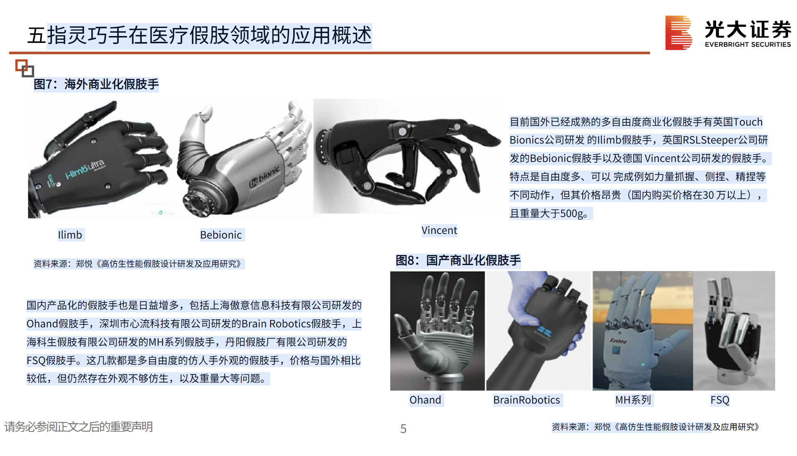
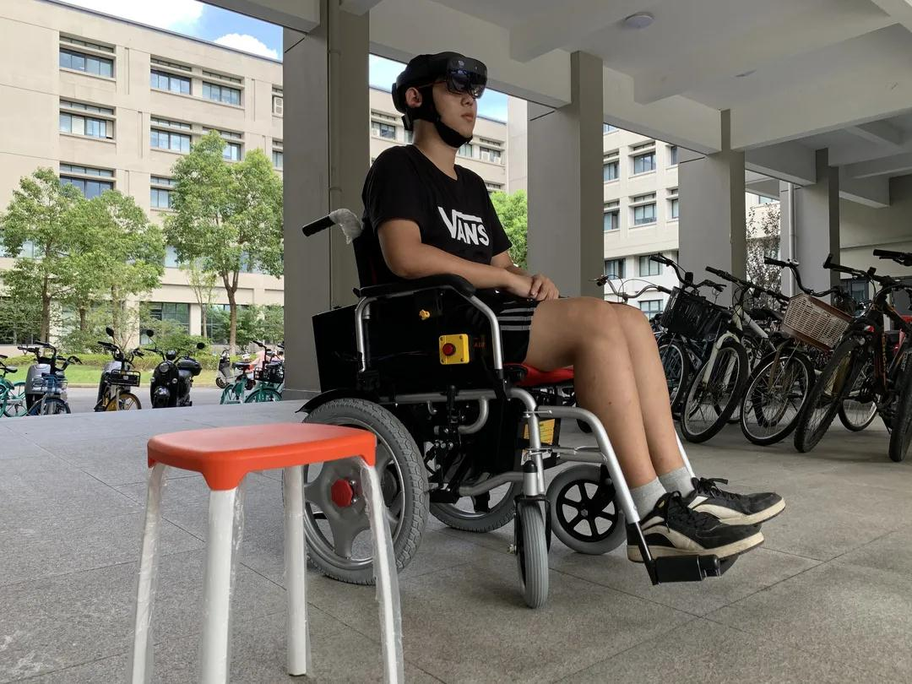
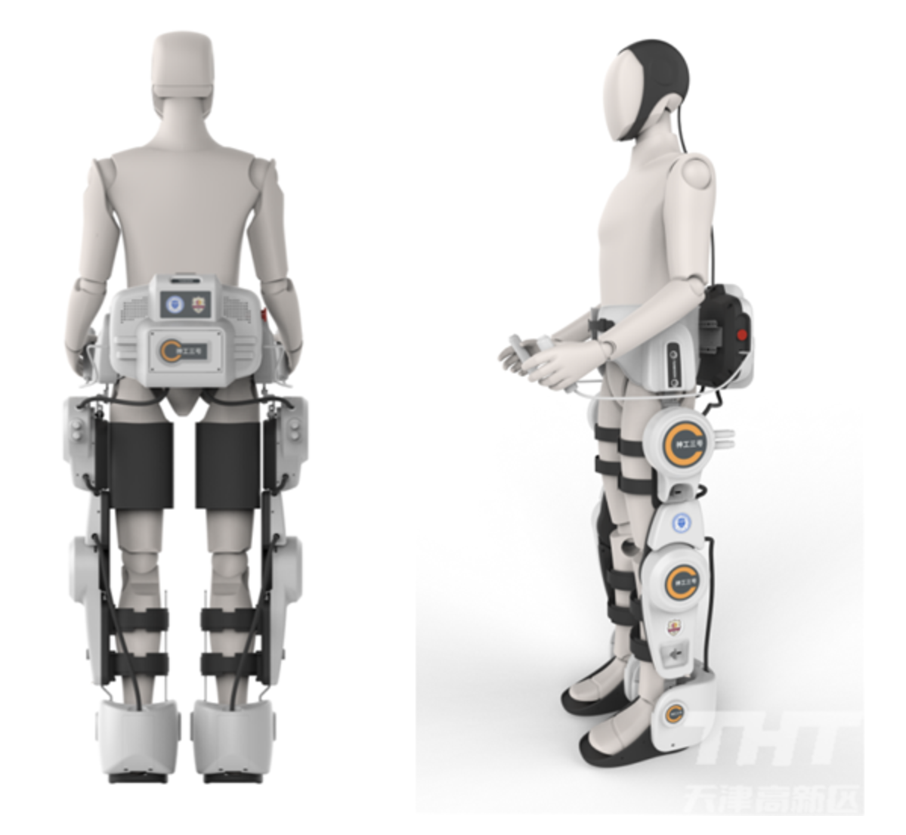
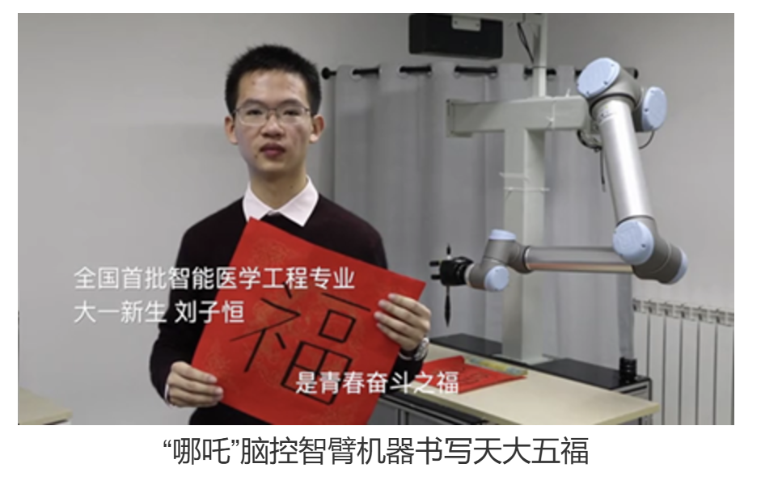
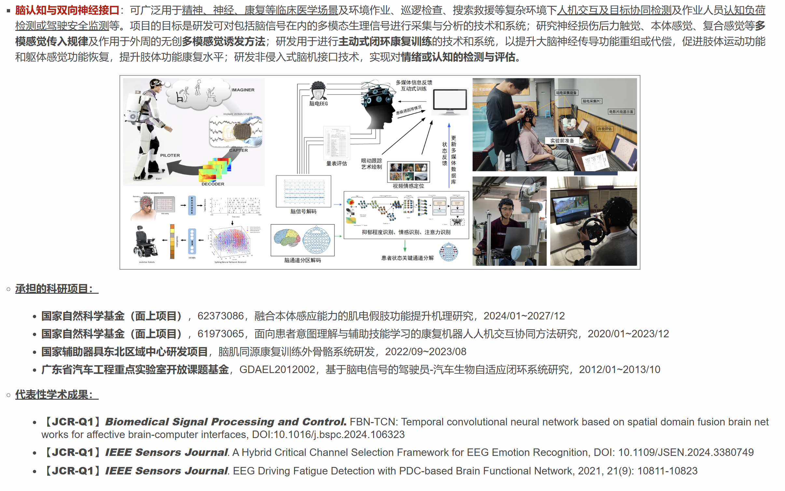
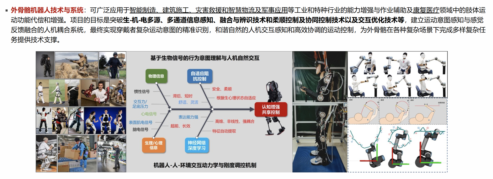
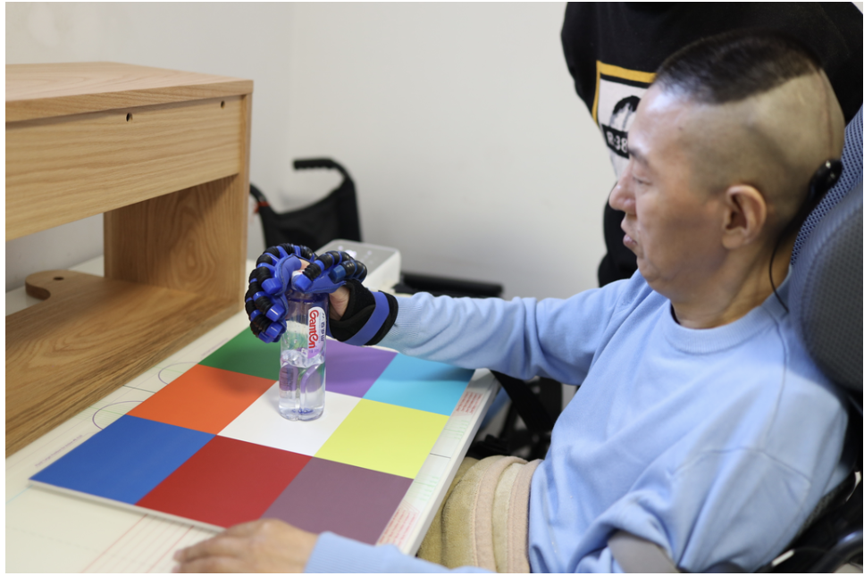

TLDR

总结，目前有潜力进行复杂脑控机器人运动的技术有：
- 清华大学神经工程实验室和博睿康共研的半侵入式微创脑机接口
- 浙江大学双脑中心王跃明教授主页完成国内首例植入式脑机接口临床转化研究。
- 首都医科大学附属天坛医院高密度柔性脑皮层电极。
- 脑虎科技的微创植入式高通量柔性脑机接口系统
- 南开大学人工智能学院段峰教授猴脑内实现脑控机械臂
- 广东省智能科学与技术研究院丘志海光和声无创脑成像
- 中国电科14所人脑机实验室尹奎英（这个可能是假的，没有论文，不确定）
- 天津大学脑机交互与人机共融海河实验室助行系统。
- 东北大学智能感知与人机交互实验室外骨骼。
- 华东理工大学脑机接口及控制实验室运动想象脑机接口
- 华中科技大学人工智能与自动化学院伍冬睿教授团队运动想象脑机接口。
- 北京理工大学毕路拯教授同时控制左右两肢连续运动的脑控外骨骼。

肌电控制机械臂的企业有：

上海傲意信息科技有限公司（OYMotion傲意科技）产品Ohand

上海科生假肢有限公司

brainco  产品brainrobotics

ottobock 产品米开朗基罗智能仿生手

日照博尔康 产品 i-Limb 量子仿生手

利用metaso.cn检索了所有国内知名机构，双一流学校，以及知名企业。有些机构的研究成果太少，或者与脑控机器人太无关，就会不放在表格中。尽管我会矫正一些信息，但是AI生成也不可避免一些错误。因此我在后面的表格中做了二次筛选，手动去官网查看信息。

| 机构名称 | 机构类型 | 基本信息 | 研究内容 | 成果与影响 | 合作网络 |-|
|---------|----------|----------|----------|------------|----------|-|
| 清华大学-IDG/麦戈文脑科学研究院 | 高校研究院 | • 领头人：时松海教授 • 知名成员：   - 高小榕(SSVEP-BCI专家)   - 王华明(神经工程)   - 姚期智(类脑计算)   - 施路平(神经科学) • 所属：清华医学院 • 资金：IDG资本及麦戈文先生捐赠(每年约2000万) • 成立：2015年 | • 研究方向：   - 神经调控技术   - 脑机接口系统   - 类脑计算   - 脑起搏器技术 • 核心技术：   - 光遗传学高空间分辨率神经调控   - DeepCAD-RT自监督深度学习   - 中文脑机接口输入系统   - 类脑计算芯片 | • 重要成果：   - 双光子光遗传技术实现高分辨率神经调控   - 实时噪声抑制的荧光成像   - 渐冻症患者脑控打字系统   - 高场磁共振环境下脑起搏器应用 • 转化应用：   - 医疗技术在数百家医院应用   - 技术推广至英国、新加坡等国家 | • 主要合作：   - 博睿康科技(脑机接口)   - 天坛医院(临床转化) • 国际合作：   - 英国帝国理工   - 新加坡国立大学 • 产业化：   - 多家医疗器械公司 |-|
| 清华大学神经工程实验室 | 高校实验室 | • 领头人：   - 李路明教授(实验室主任) • 知名成员：   - 钱天翼(脑机接口技术研究)   - 杨曌(儿童癫痫患者神经调控疗法)   - 洪波(微创脑机接口植入手术) • 所属：清华大学神经调控技术国家工程实验室 • 资金来源：   - 国家自然科学基金   - 清华大学科技成果转化基金   - IDG资本及麦戈文捐赠(每年约2000万)   - 红杉资本、松禾资本等多轮融资 | • 研究方向：   - 半侵入式微创脑机接口   - 脑起搏器技术   - 迷走神经刺激器   - SSVEP脑机接口技术   - 类脑互补视觉芯片   - 柔性神经电极技术 • 重点平台：   - 高性能脑电采集系统   - 中文输入视觉脑机接口系统   - 无线微创脑机接口平台 | • 重要成果：   - 成功研发脑起搏器，打破美国技术垄断   - 世界首款类脑互补视觉芯片   - 高位截瘫患者意念控制光标成功   - 全球首个3T磁共振相容脑起搏器   - 获2018年度国家科学技术进步奖一等奖 • 应用领域：   - 帕金森病治疗   - 癫痫治疗   - 脑机接口康复   - 神经调控技术 | • 国内合作：   - 宣武医院   - 天坛医院   - 博睿康科技   - 脑陆科技 • 国际合作：   - 麻省理工学院   - 哈佛大学   - 特拉维夫大学 • 产学研合作：   - 已覆盖300多家医院   - Open-BrainUp平台 |
| 北京大学-IDG/麦戈文脑科学研究院 | 高校研究院 | • 领头人：饶毅教授 • 知名成员：   - 罗敏敏(神经科学)   - 王宁(认知神经)   - 韩济生(神经生物学) • 资金：IDG资本和麦戈文夫妇捐赠(1000万美元) • 成立：2016年 | • 研究方向：   - 行为神经科学   - 遗传神经科学   - 认知神经科学 • 重点平台：   - 脑科学与类脑研究中心   - 光学探针实验室 • 核心技术：   - 活体成像技术   - 神经环路解析 | • 主要成果：   - 活体超分辨成像技术   - 认知障碍相关研究 • 影响：推动"中国脑计划"实施 • 应用领域：   - 重大疾病研究   - 类脑计算   - 脑机智能 • 最新进展：神经环路精准干预技术 | • 国内合作：   - 北京脑科学中心   - 中科院神经所 • 国际合作：   - 哈佛大学   - 斯坦福大学 • 产学研合作：   - 多个IDG研究院 |
| 北京脑科学与类脑研究中心 | 研究中心 | • 领头人：   - 饶毅(北京大学理学部主任)   - 罗敏敏(北京生命科学研究所研究员) • 知名成员：   - 张晨(北脑学者)   - 李莹(动物社交行为研究) • 资金来源：   - 总投入约14亿元   - 国家自然科学基金委   - 国家"973"计划   - 六个核桃科研基金(千万级) | • 研究方向：   - 脑科学与类脑智能研究   - 神经退行性疾病   - 脑血管病和脑肿瘤   - 抑郁症研究   - 认知障碍疾病 • 重点平台：   - 光学影像中心   - 实验动物中心   - 基因组学中心   - 北脑-天坛临床医学转化实验室 | • 重要成果：   - 发现D型丝氨酸对睡眠的调控作用   - 开发腺相关病毒载体标记方法   - 实现全脑范围单神经元完整重构   - SIMPLE技术表征中风脑损伤机制 • 应用领域：   - 脑重大疾病诊疗   - 类脑计算   - 基因治疗药物转化 | • 国内合作：   - 清华大学(神经信息研究)   - 北京大学(临床研究)   - 天坛医院(多模态脑成像)   - 中国医学科学院 • 国际合作：   - 哈佛大学麻省总医院   - 约翰霍普金斯大学   - 麻省理工学院   - 瑞典卡罗林斯卡大学 |
| 复旦大学脑科学前沿科学中心 | 高校研究院 | • 领头人：杨雄里院士 • 知名成员：   - 沈敏杰(神经发育障碍研究)   - 吴瑞琪(神经影像学)   - 王守岩(脑机接口) • 所属：复旦大学 • 资金来源：   - 国家"珠峰计划"   - TCCI捐赠(5亿元)   - 复星集团(1亿元)   - 地方政府支持 | • 研究方向：   - 感知机制及类脑计算   - 记忆编码与类脑模拟   - 脑神经环路发育   - 脑损伤和功能修复 • 重点平台：   - 磁共振成像平台   - 脑机接口技术平台   - 类脑智能研究平台 | • 重要成果：   - 精准定位抑郁症患者脑功能异常区域   - 揭示灵长类大脑皮层抑制性中间神经元起源   - 研发无线脑机接口芯片   - 开发老年认知障碍风险测评系统 • 应用领域：   - 神经疾病诊疗   - 脑机接口技术   - 类脑智能应用 | • 国内合作：   - 复旦附属华山医院   - 复旦附属儿科医院   - 复旦附属肿瘤医院 • 国际合作：   - 伦敦国王学院   - 开普敦大学 • 产学研合作：   - 多家医疗器械公司   - 生物科技企业 |
| 复旦大学脑科学研究院 | 高校研究院 | • 领头人：   - 马兰教授(现任院长)   - 杨雄里院士(学术委员会主任) • 知名成员：   - 来滨(药物成瘾研究)   - 吴瑞琪(神经影像学)   - 沈敏杰(神经发育障碍)   - 王守岩(脑机接口) • 资金来源：   - 国家"珠峰计划"   - TCCI捐赠(5亿元)   - 复星集团(1亿元)   - 地方政府支持   - 国家自然科学基金重点项目   - 科技部"973计划"项目   - 上海市科委基础研究重大项目 | • 研究方向：   - 神经活动基本过程   - 脑的高级认知功能   - 神经系统疾病机制和防治   - 脑机接口技术   - 类脑智能研究 • 重点平台：   - 磁共振成像平台   - 脑机接口研究中心   - 多模态多尺度脑数据库   - 数字孪生脑平台 • 核心技术：   - 遗传编码光催化技术   - 神经元精准调控   - 类脑智能芯片   - 脑深部电极植入 | • 重要成果：   - Nature等顶级期刊论文153篇   - 国家自然科学二等奖1项   - 国家科技进步二等奖3项   - 吗啡奖赏作用神经机制研究   - UKB-DRP痴呆风险预测模型   - "探极"系列类脑智能芯片 • 应用领域：   - 脑疾病诊疗   - 神经康复   - 类脑计算   - 药物研发 | • 国内合作：   - 上海交通大学医学院   - 华山医院   - 天坛医院   - 中科院上海有机化学研究所 • 国际合作：   - 哈佛大学   - 斯坦福大学 • 产学研合作：   - 医疗器械公司   - 制药企业   - 人工智能企业 |
| 复旦大学类脑智能科学与技术研究院 | 高校研究院 | • 领头人：   - 冯建峰教授(院长，上海数学中心首席科学家) • 知名成员：   - Deniz Vatansever(认知神经机制)   - 聂英男(帕金森病研究)   - 冈特·舒曼(精神障碍研究)   - 朱山风(蛋白质研究)   - 单洪明(医学影像) • 资金来源：   - 国家自然科学基金委   - 上海市科委   - 上海市"脑与类脑智能基础转化应用研究"重大科技专项(8.4亿) | • 研究方向：   - 脑科学与类脑智能   - 神经机制解析   - 全脑计算   - 脑机接口技术 • 重点平台：   - 计算神经科学与类脑智能教育部重点实验室   - 全脑数字孪生平台   - 脑机接口研究中心   - 多模态脑数据库 | • 重要成果：   - 全球首个千亿级神经元数字孪生脑平台   - 全球首个具备动态双目立体视觉和视听多模态控制的机器头脑   - 阿尔茨海默病早期预测技术   - Nature等顶级期刊论文发表 • 应用领域：   - 脑疾病诊疗   - 类脑计算   - 智能机器人   - 医疗影像分析 | • 国内合作：   - 华山医院   - 复旦附属医院   - 天坛医院 • 国际合作：   - 牛津大学   - 剑桥大学   - 哈佛大学 • 产学研合作：   - 蘑菇车联   - 多家医疗器械公司 |
| 浙江大学医学院附属第二医院 | 医疗机构 | • 领头人：   - 吴志英(院长) • 知名成员：   - 段淑敏(医学研究院院长，神经精神疾病研究)   - 李晓明(医学研究院院长，焦虑障碍研究)   - 郑晓香(丘吉斯高级研究院) • 资金来源：   - 国家自然科学基金   - 浙江省自然科学基金   - 科技部科技创新2030脑科学项目   - 总研究经费超1.6亿元 | • 研究方向：   - 脑机接口控制机械手臂   - 神经影像学研究   - 中风、渐冻人康复训练 • 核心技术：   - 侵入式电极植入技术   - 脑血管病研究技术 • 重点平台：   - 浙江大学-斯坦福大学健康联合实验室   - "健康+"平台 | • 重要成果：   - 全国首例植入式脑机接口临床研究   - 发表SCI论文75篇(含Science 1篇、Nature 2篇)   - 发明专利48项(已授权11项)   - 制定高血压脑出血微创治疗规范 • 国际合作：   - 美国斯坦福大学医学中心 • 转化应用：   - 72岁高位截瘫患者意念控制机械臂案例   - 多孔微针贴片技术应用于脊髓损伤修复 |
| 浙江大学脑与脑机融合前沿科学中心 | 高校研究院 | • 领头人：   - 段树民院士(首席科学家)   - 胡海岚教授(中心主任)   - 杜江峰院士(管理委员会主任) • 知名成员：   - 祁玉(大脑计算建模)   - 杨俊华(胶质细胞研究)   - 马志国(神经胶质细胞)   - 李涛(精神疾病研究) • 成立：2018年10月 • 资金：   - 教育部前沿科学中心项目   - 国家重点研发计划   - 国家自然科学基金 | • 研究方向：   - 脑机接口技术   - 多模态脑功能成像   - 神经胶质细胞研究   - 精神疾病研究 • 重点平台：   - 临床侵入式脑机接口平台   - 脑功能成像平台   - 神经调控技术平台 | • 重要成果：   - 国际首个脑机融合听视觉增强大鼠   - 国内首例临床病人颅内植入电极   - 高龄志愿者3D运动控制闭环脑机接口系统 • 学术成果：   - Nature等顶级期刊论文11篇   - 48项发明专利申请(11项已授权) • 应用领域：   - 脑认知评估   - 神经功能重塑   - 康复医疗 | • 国内合作：   - 浙江大学医学院   - 浙江大学计算机学院 • 国际合作：   - 剑桥大学临床医学院   - 南安普顿大学医学院   - 约翰斯·霍普金斯大学 • 产学研合作：   - 世纪华通公司 |
| 中国科学院-脑科学与智能技术卓越创新中心 | 科研机构 | • 领头人：蒲慕明院士 • 知名成员：   - 熊志奇(星形胶质细胞与脑钙化研究)   - 竺淑佳(神经系统自身免疫性脑炎)   - 蔡时青(单碱基基因编辑) • 所属：中科院 • 成立：2014年 • 下设平台：   - 脑科学微纳加工平台   - 神经信息学平台   - 脑健康与康复平台 | • 研究方向： 1. 认知功能研究：   - 神经元发育机制   - 突触可塑性研究   - 认知功能神经环路 2. 疾病机制研究：   - 脑钙化症机理   - 抑郁症发病机制   - 自闭症基因研究 3. 技术开发：   - 类脑芯片研发   - 脑机接口系统   - 神经调控技术 4. 临床转化：   - 抗衰老方案   - 帕金森病诊治   - 认知障碍干预 | • 重要成果： 1. 基础研究：   - 揭示星形胶质细胞调控脑内磷酸根离子稳态机制   - 阐明氯胺酮作用于NMDA受体的结构基础   - 建立携带人类自闭症基因的灵长类模型 2. 技术突破：   - 开发脑钙化症反义核苷酸疗法   - 实现体细胞克隆猴技术   - 建立无脱靶基因编辑工具 3. 临床应用：   - 开发意识状态评测工具   - 建立认知障碍早期筛查系统   - 研发新型抗抑郁药物 | • 国内合作： 1. 高校合作：   - 复旦大学附属中山医院   - 北京师范大学脑科学研究院   - 中科院上海生科院 2. 医疗机构：   - 天坛医院   - 华山医院 3. 地方政府：   - 绍兴市人民政府 • 国际合作： 1. 欧洲：   - 瑞士洛桑联邦理工(EPFL) 2. 美洲：   - 塔夫茨大学   - 波士顿大学   - 古巴神经科学中心 • 资金来源：   - 国家自然科学基金   - 科技部重大专项   - 中科院战略性先导科技专项 |
| 中科院自动化所智能感知与计算研究中心 | 科研机构 | • 领头人：   - 张兆翔 • 知名成员：   - 刘成林(类脑认知计算模型)   - 谭铁牛(类脑多模态感知计算)   - 宗成庆(类脑语言和知识处理)   - 蒋田仔(脑网络组图谱研究) • 资金来源：   - 国家自然科学基金重点项目   - 国家重大科研仪器项目   - 国家重点研发计划   - 中科院先导A/C类项目   - 天津市重点研发计划   - 四川省重点研发计划 | • 研究方向：   - 深度认知神经网络理论   - 注意记忆计算模型   - 类脑神经网络建模   - 生物启发的智能计算 • 重点平台：   - 中瑞数据驱动神经科学联合实验室   - 语言与知识计算联合实验室   - 超高速电镜成像与智能分析联合实验室 | • 重要成果：   - 发表论文900余篇   - 授权专利200余项   - 获国家技术发明二等奖等多项国家级奖项   - PASCAL VOC目标检测竞赛连续两年冠军 • 国际合作：   - 瑞士洛桑联邦理工大学   - 美国塔夫茨大学   - 波士顿大学 • 国内合作：   - 中科院神经所   - 北京师范大学脑与认知科学研究院 |
| 模式识别国家重点实验室 | 科研机构 | • 领头人：谭铁牛院士(学术委员会主任) • 知名成员：   - 蒋田仔(获国际脑电图与临床神经科学学会最高奖)   - 王亮(IEEE Fellow)   - 宗成庆(国际计算语言学会会员) • 所属：中国科学院自动化研究所 | • 研究方向：   - 多模态脑影像映射技术   - 脑机接口系统开发   - 神经计算与脑机交互 • 核心技术：   - ERP原型匹配网络   - SSVEP解码模型   - 可穿戴式脑电信号检测设备 | • 重要成果：   - 绘制全新人类脑图谱(比传统精细4-5倍)   - 开发基于度量元学习的ERP匹配网络   - 建立新型SSVEP解码模型 • 应用领域：   - 脑疾病诊断治疗   - 神经科学研究   - 脑机接口应用 | • 国内合作：   - 天津医科大学   - 清华大学   - 国防科技大学 • 国际合作：   - 德国杜塞尔多夫大学   - 昆士兰大学 • 资金来源：   - 国家重点研发计划   - 国家自然科学基金   - 国际合作项目 |
| 中国科学院神经科学国家重点实验室 | 科研机构 | • 领头人：杜久林研究员 • 知名成员：   - 蔡时青(抗衰老研究)   - 孙衍刚(痒觉机制)   - 周嘉伟(神经炎症) • 成立：1989年 | • 研究方向：   - 脑的可塑性研究   - 神经环路机制   - 基因编辑技术 • 核心技术：   - CRISPR/dCas9体内激活系统   - 光遗传学技术   - 共聚焦光场显微镜 | • 重要成果：   - 揭示胶质细胞-神经元信号调节衰老机制   - 发现痒觉中枢环路   - 建立小鼠前额叶单神经元投射图谱 • 应用领域：   - 神经退行性疾病   - 精神疾病治疗   - 脑功能研究 | • 资金来源：   - 国家重点实验室资助   - 科技部专项   - 中科院先导专项 • 合作机构：   - 上海科技大学   - 瑞金医院   - 上海巴斯德研究所 |
| 上海交通大学智能交互与认知工程上海高校重点实验室 | 高校实验室 | • 领头人：   - 吕宝粮教授(实验室主任)   - 张钹院士(学术委员会主任)   - 徐雷教授(副主任) • 知名成员：   - 张丽清教授(学术委员) • 资金来源：   - 国家973计划   - 国家863计划   - 国家自然科学基金   - 上海市科委重点项目 | • 研究方向：   - 脑机交互技术   - 语音语言处理   - 类脑芯片研究   - 机器学习与类脑智能 • 重点平台：   - 脑机交互可穿戴设备平台   - 脑功能康复系统平台   - 多模态情感交互平台 | • 重要成果：   - 跨被试脑电情感模型构建   - 无创脑机交互技术突破   - 脑控机器人技术开发   - 情感脑电数据集SEED • 应用领域：   - 虚拟驾驶系统   - 抑郁症评估诊断   - 脑控轮椅和护理床 | • 国内合作：   - 上海交大医学院   - 零唯一思科技 • 国际合作：   - 日本理化学研究所   - 剑桥大学   - 柏林工业大学   - 京都大学 • 产学研合作：   - 微软亚洲研究院 |
| 上海交通大学医学院医学科学研究所 | 科研机构 | • 领头人：   - 徐天乐教授(基础医学院) • 知名成员：   - 管阳太教授(神经炎症研究)   - 方贻儒教授(情感障碍研究)   - 郑元义教授(神经物理调控与影像监控)   - 刘军教授(神经退变研究)   - 赵敏教授(成瘾与应激研究)   - 李斐教授(社交障碍研究) • 资金来源：   - 国家科技部"中国脑计划"项目   - 国家自然科学基金重点项目   - 上海市科委资助   - 教育部专项资金   - 校级基金支持 | • 研究方向：   - 神经回路与行为发展   - 学习和记忆的原则与调控   - 脑疾病药物靶点发现 • 核心技术平台：   - 脑解剖学与连接组学中心   - 脑生理学与功能中心   - 动物行为与表型分析中心 • 重要设施：   - 电生理记录系统   - 光遗传学刺激系统   - 钙活动记录系统   - 行为检测仪器 | • 重要成果：   - 发表论文140余篇(包括Neuron、eLife等)   - 编写首部ASIC英文专著   - 获国家杰出青年科学基金等多项奖励 • 国际合作：   - 耶鲁大学   - 哈佛大学医学院   - 以色列希伯来大学   - 澳大利亚墨尔本大学 • 重点平台：   - 上交医-耶鲁大学免疫代谢研究院   - 单细胞组学与疾病研究中心   - 中加联合实训中心 |
| 上海大学脑机工程研究中心 | 高校实验室 | • 领头人：   - 杨帮华教授(人工智能与医工交叉研究中心主任) • 知名成员：   - 4名年轻教授 • 顾问：   - 关存太(新加坡南阳理工大学脑科学院士) • 资金来源：   - 上海基础研究计划   - 上海市科技委员会(500万专项)   - 宝山区政府支持 | • 研究方向：   - 脑电/肌电采集技术   - 多模脑信号解码技术   - 智能解码理论   - 虚拟现实康复训练 • 重点平台：   - 脑控轮椅系统   - AR眼镜脑机接口   - 康复训练系统 | • 重要成果：   - 脑控轮椅康复系统(已在40多家医院使用)   - 获得中国首例脑机接口医疗注册证   - 发表110余篇高水平论文   - 申请20余项专利 • 应用领域：   - 脑卒中康复   - 精神疾病辅助诊疗   - 认知障碍检测 | • 国内合作：   - 北京天坛医院   - 上海岳阳医院   - 同济阳光医院 • 产业转化：   - 上海韶脑传感技术有限公司   - 环上大科技园 |
| 华东理工大学脑机接口及控制实验室 | 高校实验室 | • 领头人：   - 金晶教授(信息科学与工程学院自动化系主任) • 知名成员：   - 王行愚(脑控及应用、智能控制)   - 张宇(模式识别与人工智能)   - 王蓓(脑机接口、信号处理) • 资金来源：   - 国家自然科学基金面上项目   - 中央高校专项科研基金   - 国家重点研发计划"智能机器人"重点专项 | • 研究方向：   - 基于SSVEP的拼写器系统   - 多模态脑机接口平台   - 听觉脑机接口智能机器人控制   - 脑机语言输出系统与大语言模型结合 • 重点平台：   - 全流程自适应生成式脑机接口系统   - 人工智能多模态脑机接口平台   - 非侵入式脑机接口技术平台 | • 重要成果：   - 发表论文150余篇，ESI高被引论文12篇   - 获得上海市自然科学奖二等奖   - 联合企业取得中国医疗器械注册证3张   - 世界机器人大会脑控机器人大赛全国总冠军 • 应用领域：   - 失语症患者交流   - 康复医疗   - 意识障碍患者促醒 | • 国内合作：   - 上海蓝十字脑科医院(脑复苏中心)   - 蓝生脑科研究院   - 北京大学 • 国际合作：   - 多家医院及国际项目 • 产学研合作：   - 百度文心大模型   - 多家医疗器械公司 |
| 华中科技大学人工智能与自动化学院 | 高校院系 | • 领头人：   - 曾志刚教授(长江学者、国家杰青) • 知名成员：   - 伍冬睿教授(脑机接口专家)   - 关治洪教授(类脑计算)   - 骆清铭教授(脑科学成像) • 资金来源：   - 科技部脑科学重大项目(1500万)   - 国家自然科学基金   - 企业资助(华为、阿里等) | • 研究方向：   - 脑机接口技术   - 类脑计算   - 神经形态计算   - 脑科学成像 • 重点平台：   - 脑机接口与机器学习实验室   - 全脑神经元网络可视化平台   - 高通量双色精确成像平台 | • 重要成果：   - BCI脑控机器人大赛三连冠(2019-2021)   - 全脑神经元网络可视化技术   - Nature Neuroscience发表成果 • 应用领域：   - 医疗诊断   - 脑机控制   - 类脑智能 | • 国内合作：   - 东软医疗   - 上海联影 • 国际合作：   - 剑桥大学   - 斯坦福大学   - 波兰华沙理工大学 • 产学研合作：   - 华为   - 阿里   - 蚂蚁集团 |
| 武汉大学脑科学先进技术研究院 | 高校研究院 | • 领头人：   - 曾燕教授(学科带头人) • 知名成员：   - 刘剑锋(湖北省"青年百人")   - Shawn M McClintock("楚天学者"讲座教授)   - 李金泉(楚天学子)   - 吴琼(楚天学子) • 资金来源：   - 国家自然科学基金课题   - 国家重点研发计划子课题   - 科技创新-2030"脑科学与类脑研究"重大项目   - 地方政府专项补助   - 中央高校基本科研业务费 | • 研究方向：   - 老年认知障碍早期诊断与防控   - 神经精神药理学   - 脑老化与认知衰退机制   - 类脑计算与脑机智能 • 重点平台：   - 大型生物样本库和超级计算机平台   - 光学成像信息和脑电信息采集分析平台   - 小动物行为学研究平台   - 净化细胞房和分子生物学研究平台 | • 重要成果：   - 发现我国65岁以上老年人主观认知下降患病率为58.33%   - 建立基础研究-流行病研究-社区多元干预和智慧管理四位一体的综合认知障碍社区防控体系 • 应用领域：   - 认知障碍早期诊断   - 社区防控体系建设   - 神经精神疾病研究 • 未来规划：   - 推动脑科学与类脑研究技术产业化   - 发展神经计算、仿真记忆存储等新增长点 |
| 天津大学脑机交互与人机共融海河实验室 | 高校实验室 | • 领头人：   - 顾晓松(实验室主任)   - 明东(执行主任，副校长) • 知名成员：   - 许敏鹏(片上脑机接口团队负责人)   - 刘爽(精神医学中心主任)   - 刘秀云(医学院副院长) • 成立：2023年3月 • 资金来源：   - 天津市政府引导资金   - 科技部国家重点研发资金   - 10亿元脑机海河实验室基金 | • 研究方向：   - 非侵入式脑机接口系统   - 片上脑-机接口系统   - 情感计算技术   - 神经康复机器人 • 重点平台：   - MetaBOC系统   - 神工系列医疗器械平台   - 多模态情感交互平台 | • 重要成果：   - 创造非侵入式脑机接口最大指令集世界纪录(216键)   - 全球首个可开源片上脑-机接口系统MetaBOC   - "神工"系列医疗器械获国家注册证   - 多模态生理信息情绪检测系统 • 应用领域：   - 医疗康复   - 精神疾病诊断   - 脑机控制 | • 国内合作：   - 中电云脑   - 海河产业基金   - 京津冀脑机交互产业联盟(40家机构) • 国际合作：   - 多家医院和康复研究中心 • 产学研合作：   - 燧世智能科技   - 多家医疗器械公司 |
| 东北大学智能感知与人机交互实验室 | 高校实验室 | • 领头人：   - 王宏教授(实验室主任) • 背景：   - 德国留学和工作经历   - 东北大学教授、博导 • 资金来源：   - 国家自然科学基金重点项目   - 国家重点研发计划 | • 研究方向：   - 生机电一体化   - 康复工程   - 脑-机器人接口   - 类脑神经网络 • 重点平台：   - 多模态信息融合平台   - 类脑计算芯片仿真平台   - 人机交互闭环系统 | • 重要成果：   - 基于脑/肌电的行为识别与解码   - 三维运动感应与交互系统   - 脑控无人机系统(获美国专利) • 获奖：   - 国家科技进步二等奖   - 教育部科技进步一等奖 | • 国内合作：   - 大连蒂艾斯科技   - 英特尔FPGA中国创新中心 • 国际合作：   - 台湾半导体研究机构   - 密歇根州立大学   - 香港中文大学 |
| 电子科技大学数字孪生脑模型研究团队 | 高校实验室 | • 领头人：   - 尧德中教授(生命科学与技术学院)   - 郭大庆教授 • 所属：   - 生命科学与技术学院神经工程与神经数据团队   - 中国医学科学院神经信息创新单元 • 资金来源：   - 国家自然科学基金重点项目   - 科技部863项目   - 973课题 | • 研究方向：   - 数字孪生脑模型平台搭建   - 类脑智能研究   - 脑器交互技术   - 稳态视觉诱发电位响应机制   - 大尺度脑活动动力学建模 • 重点平台：   - 国内首个数字孪生脑计算平台   - 多模态神经影像数据融合平台 | • 重要成果：   - 建立国内首个数字孪生脑计算平台   - 揭示SSVEP信号频率敏感特性   - 发表多篇PNAS、Nature Communications等重要论文 • 应用领域：   - 多发性硬化症研究   - 抑郁症研究   - 脑肿瘤建模   - 类脑智能开发 | • 国内合作：   - 中国香港大学   - 四川省肿瘤医院   - 华西医院 • 研究突破：   - MS患者脑萎缩预测(早于临床症状5-6年)   - 抑郁症患者脑组织模拟(准确率>90%) |
| 四川大学计算机学院类脑计算研究中心 | 高校研究院 | • 领头人：   - 唐华锦教授(研究中心主任，之江实验室新型智能计算中心课题负责人) • 知名成员：   - 黄铁军教授(神经形态芯片与计算机论坛主席)   - 赵地、陈云霁、汪玉等研究人员 • 成立时间：2020年1月 • 资金来源：   - 国家自然科学基金青年项目   - 1X3计划重点研究项目   - 国家脑计划亿级项目   - 国家AI2.0计划项目   - 之江实验室千万级项目   - 国家杰出青年基金 | • 研究方向：   - 类脑计算基础研究   - 感知信息处理   - 神经形态智能硬件   - 大规模认知计算网络   - 脑机混合智能 • 重点平台：   - 类脑计算与机器人认知实验室(NCRC)   - 脑机智能全国重点实验室   - 神经形态芯片研发平台   - 人工视网膜与听觉处理平台 | • 重要成果：   - 发表80余篇高水平论文   - "受生物视觉启发的智能感知理论与算法"获2020年吴文俊人工智能自然科学奖三等奖   - 中国首例临床侵入式3D运动控制闭环脑机接口系统   - "达尔文"系列类脑芯片   - 国际上神经元规模最大的类脑计算机 • 专利成果：   - 类脑计算芯片和数据处理终端   - 基于斯格明子的随机数据流计算系统   - 神经网络模型自动适配方法   - 通用型AI并行推理加速结构   - 基于斯格明子的人工突触器件   - 非易失性存内计算芯片 | • 国内合作：   - 电子科技大学   - 四川省脑科学与类脑智能研究院   - 成都时识科技有限公司 • 研究应用：   - 城市治理   - 公共服务   - 工业医疗   - 交通农业   - 金融物流 • 重要项目：   - 数字孪生脑计算平台   - 重大脑疾病信息学机制研究   - 国际化神经大数据精准分析 |
| 南京航空航天大学脑机智能技术教育部重点实验室 | 高校实验室 | • 领头人：   - 张道强(实验室主任) • 知名成员：   - 秦杰教授(计算机科学与技术学院/人工智能学院/软件学院副主任)   - 魏明强(大型航空装备外形几何处理与分析)   - 朱旗(脑网络拓扑分析与脑疾病诊断)   - 李丕绩(大模型及自然语言处理) • 成立时间：2023年 • 资金来源：   - 国家自然科学基金(62373188, 62003162)   - 江苏省自然科学基金(BK20200416)   - 中央高校基本科研业务费   - 开放课题基金(3-5万元/项目) | • 研究方向：   - 脑认知计算   - 机器智能   - 脑机融合智能   - 类脑器件与芯片   - 类脑体系结构   - 类脑大模型   - 神经解码方法   - 神经调控技术 • 重点平台：   - 脑机接口控制平台   - 飞行员应急水平评估系统   - 智能发动机平台   - 无人机集群实验平台 | • 重要成果：   - 国家科技进步二等奖   - 教育部科技进步一等奖   - 入选中国高等学校十大科技进展   - 入选世界互联网领先科技成果   - 研究成果被MIT Technology Review等国际媒体报道 • 应用领域：   - 军事智能   - 航空装备   - 医疗诊断   - 脑机接口 | • 国内合作：   - 湖南省肿瘤医院(微波消融)   - 中科院深圳先进技术研究院(医疗器械)   - 深圳大学(生物光学)   - 东南大学中大医院   - 南京军区总医院(医学影像)   - 中国药科大学(药效研究) • 国际合作：   - 意大利罗马大学   - 德国汉堡大学   - 美国伊利诺伊理工大学   - 日本理化学研究所   - 马耳他大学生物医学控制中心 |
| 昆明动物研究所脑科学与认知科学国家重点实验室 | 科研机构 | • 领头人：   - 陈霖院士   - 马原野研究员(灵长类认知神经科学实验室负责人) • 知名成员：   - 李岩研究组(中枢胰岛素信号研究)   - 张朋研究组(皮层下通路研究)   - 刘宁研究组(颜色编码机制研究)   - 王毅研究员(青年学术骨干)   - 刘力研究员(国家杰出青年基金获得者) • 成立：2006年 • 资金来源：   - 国家自然科学基金   - 科技部项目   - 云南省科技专项   - 中科院先导项目 | • 研究方向：   - 灵长类认知神经科学   - 基因编辑与疾病模型   - 脑功能成像   - 神经退行性疾病 • 重点平台：   - CRISPR/Cas9基因编辑平台   - 7T全身磁共振成像系统   - 活体全脑功能成像FUS技术   - 动物行为全自动分析系统   - Bussey-saksida测试系统   - PacBio RS测序系统 | • 重要成果：   - 首次在灵长类大脑实现原位胶质细胞转化为神经元   - 揭示重性精神疾病发病机制   - 建立多个灵长类疾病模型   - 发表SCI论文78篇   - 申请发明专利5项 • 国际合作：   - 新加坡基因组研究所   - 日本藤田保健卫生大学   - 香港中文大学   - 法国INSERM脑科学研究所   - 耶鲁大学   - 芬兰科学院赫尔辛基脑研究所 |
| 粤港澳大湾区脑科学与类脑研究中心 | 研究中心 | • 领头人：   - 高天明院士(中心主任，南方医科大学教授) • 知名成员：   - 刘龙奇(单细胞组学联盟发起人)   - 熊和建(脑靶向药物研究) • 成立背景：   - 依托南方医科大学   - 汇聚粤港澳三地18家研究单位 • 资金来源：   - 省市区校联动建设经费7000万元   - 省财政资助经费300万元   - 广州市"脑科学与类脑研究"重大科技专项1.88亿元 | • 研究方向：   - 原始创新   - 前沿关键技术   - 脑认知功能解析   - 重大脑疾病机制探究 • 重点平台：   - 高通量单细胞微流控系统DNBelab C4   - 多脑区植入式微电极阵列   - 光电极阵列细胞调控技术   - 超声神经调控仪器 | • 重要成果：   - 儿童孤独症、青少年抑郁障碍生物标记物发现   - 脑靶向药物控释纳米载体研发   - 精神健康筛查系统开发 • 合作机构：   - 中国香港科技大学   - 中国科学院深圳先进技术研究院   - 深港脑科学创新研究院 • 国际合作：   - 人类细胞图谱亚洲联盟成员   - 时空组学全球联盟发起人 |
| 生物物理研究所脑与认知科学国家重点实验室 | 科研机构 | • 领头人：   - 陈霖院士   - 郭爱克院士(学术委员会主任)   - 赫荣乔研究员(副主任) • 知名成员：   - 刘力研究员(国家杰出青年基金获得者)   - 王毅研究员(青年骨干)   - 张朋博士(优秀青年科学基金获得者) • 资金来源：   - 自主研究课题经费720万元   - 开放课题年度支持经费110万元   - 国家自然科学基金   - 国际合作项目(如与芬兰合作800万元) | • 研究方向：   - 多学科交叉研究   - 视觉信息表达研究   - 脑功能区成像   - 认知神经科学 • 重点平台：   - 双光子激光共聚焦扫描显微镜   - 脑片膜片钳可视化系统   - 512道神经信号处理系统   - 7T全身磁共振成像系统   - EEG/ERP与磁共振成像结合系统 | • 重要成果：   - "973"项目优秀结题   - 发表SCI论文78篇   - 专著译著4部   - 发明专利申请5项 • 应用领域：   - 视觉系统研究   - 认知功能成像   - 神经科学基础研究 • 国际合作：   - 芬兰赫尔辛基大学   - 国际认知科学联合会 |
| 中国电科14所人脑机实验室 | 科研机构 | • 领头人：   - 尹奎英博士(团队领头人) • 知名成员：   - 王剑书(90后博士)   - 喻超(海归博士) • 团队特点：   - 平均年龄不到33岁的年轻团队 • 资金来源：   - 国家自然科学基金委员会"十四五"重大项目   - 国家重点研发计划   - 科技部脑科学与类脑研究重大项目 | • 研究方向：   - 雷达技术与生物医学跨界融合   - 脑机接口技术   - 人工智能医疗应用 • 核心技术：   - 全脑导航技术   - 脑电视觉重构技术   - 多模态信号处理 • 重点平台：   - "灵犀手"脑机接口系统   - 可穿戴脑电帽控制外骨骼系统   - 阿尔茨海默病筛查平台 | • 重要成果：   - "灵犀手"获2021年世界人工智能大会SAIL奖TOP30   - 申请并受理IEC世界标准两项   - 立项国家标准一项   - 阿尔茨海默病筛查准确率超90%   - 成功帮助瘫痪儿童实现手部抓握 • 合作网络：   - 南京脑科医院（阿尔茨海默症筛查） • 应用领域：   - 医疗康复   - 残障辅助   - 智能教育 |
| 北京航空航天大学自动化科学与电气工程学院 | 高校实验室 | • 领头人：   - 李阳教授(副院长，国家杰出青年科学基金获得者) • 知名成员：   - 多位获国家奖学金的研究生 • 资金来源：   - 国家自然科学基金联合重点项目   - 国家重点研发计划专项   - 北京市自然科学基金重点项目   - B+轮融资近亿元(慧创医疗) | • 研究方向：   - 人工智能脑疾病诊断   - 医学图像分析   - 脑机接口与神经康复工程   - 多模态脑网络学习 • 核心技术：   - 多通道近红外脑成像装备   - 脑电图(EEG)分析   - 功能性磁共振成像(DTI/fMRI)   - 深度学习计算分析 • 重点平台：   - 多通道近红外脑功能成像系统   - 脑机智能意念控制医疗床系统   - 癫痫发作预警与神经调控系统 | • 重要成果：   - 发表SCI论文60余篇   - ESI高被引论文2篇   - SCI他引2000余次   - 获吴文俊人工智能科学技术奖 • 合作网络：   - 北京大学   - 北京师范大学   - 北京天坛医院   - 宣武医院   - 华西医院   - 清华大学 • 应用领域：   - 脑疾病早期诊断   - 神经康复训练   - 医疗设备研发 |
| 北京理工大学脑科学团队 | 高校实验室 | • 领头人：   - 船桥新太郎教授 • 知名成员：   - 王志敏副教授(大脑皮层功能、医学人工智能)   - 李博助理教授(脑机接口、超精细图谱绘制)   - 杨国元助理教授(儿童脑影像、航天环境神经损伤) • 资金来源：   - 北京市财政资金支持   - 科技部脑科学与类脑研究重大项目 | • 研究方向：   - 联邦学习医疗应用   - 睡眠障碍研究 • 重点技术：   - 理解、模拟、保护三位一体研究模式   - 新型成像分析方法和测量装备   - 脑细胞外间隙探测技术 • 重要平台：   - MARX智能脑控康复系统   - 多任务操控的脑机协同控制平台 | • 重要成果：   - Nature、Nature Neuroscience等顶级期刊发表成果   - 新型脑病药物精准递送系统   - 发表论文10余篇 • 国际合作：   - 哈佛大学   - 耶鲁大学   - 麻省理工学院   - 斯坦福大学 |
| 复旦大学附属华山医院 | 医疗机构 | • 领头人：   - 毛颖教授(院长，脑疾病治疗专家) • 知名成员：   - 郁金泰教授(神经内科副主任，认知障碍方向带头人)   - 宫晔教授(神经外科，脑膜瘤研究)   - 王立平教授(意识障碍研究)   - 吴雪海教授(神经影像学)   - 吴瑞琪教授(AI医疗影像) • 资金来源：   - 国家自然科学基金   - 科技部脑科学与类脑研究重大项目   - 上海市科技委员会支持   - TCCI捐赠(5亿人民币)   - 国家级平台建设资金 • 重要地位：   - 国家神经疾病医学中心   - 国家临床重点专科 | • 研究方向：   - 阿尔茨海默病药物靶点研究   - 脑膜瘤WHO级别预测   - 意识障碍诊断与预后   - 脑机接口技术   - 神经退行性疾病研究   - 脑影像学研究 • 重点平台：   - I期临床研究中心   - 分子与转化医学研究所   - 脑科学前沿实验室   - 张江国际脑影像中心   - 全维度脑科学数据库 • 核心技术：   - 高通量神经信号采集芯片   - AI辅助诊断系统   - VR认知功能评估系统   - 基于uMR 790的磁共振成像 | • 重要成果：   - 完成全国第三例脑机接口临床试验植入手术   - 绘制痴呆可调控危险因素图谱   - 发现AD药物新靶点(ACE等基因)   - 开发脑膜瘤WHO级别AI预测模型   - 建立意识障碍诊断新方法   - 开发VR老年痴呆筛查系统 • 临床转化：   - 多个神经系统疾病诊疗新方案   - AI辅助诊断系统临床应用   - VR认知评估系统推广应用 • 学术影响：   - 发表多篇高水平论文   - 获得多项国家级科技奖励 | • 国内合作：   - 复旦大学脑科学研究院   - 中科院神经科学研究所   - 上海交通大学医学院   - 陈天桥雒芊芊研究院(TCCI) • 国际合作：   - 哈佛大学医学院   - 耶鲁大学医学院   - 斯坦福大学医学院   - 麻省理工学院 • 产学研合作：   - 联影医疗科技   - 多家医疗器械公司   - 制药企业 • 人才培养：   - 博士后流动站   - 住院医师规范化培训基地   - 国家级继续医学教育基地 |
| 中国香港科技大学分子神经科学国家重点实验室 | 科研机构 | • 领头人：   - 叶玉如教授(实验室主任) • 知名成员：   - 张明杰教授(神经信号转导研究) • 资金来源：   - 国家自然科学基金港澳优秀青年科学基金   - 香港特别行政区大学教育资助委员会基金   - 香港特别行政区政府创新科技署基金   - 国家科技部直接资助 | • 研究方向：   - 阿尔茨海默症等神经退化性疾病研究   - 神经信号转导研究   - 精神分裂症分子机制研究   - 脑胶质瘤治疗研究 • 核心技术：   - 全脑基因编辑技术   - 激光共聚焦成像系统   - 生物标志物开发平台   - 数字免疫测定技术 | • 重要成果：   - 开发首个基于血液蛋白组合的AD诊断试剂盒   - 研发新型全脑基因编辑技术   - 开发AI阿尔茨海默症评分系统(准确率>96%)   - 完成AD患者血液生物标志物全面筛查 • 应用领域：   - 神经退行性疾病诊断   - 精准医疗   - 药物研发 | • 国际合作：   - 荷兰脑库   - 澳大利亚昆士兰大学   - 韩国科学与技术研究院   - 哈佛大学医学院   - 史丹福大学医学院   - 伦敦大学学院 • 国内合作：   - 中科院深圳先进技术研究院   - 香港中文大学 |
| 中科院深圳先进技术研究院 | 科研机构 | • 领头人：   - 王立平(所长)   - 周晖晖(副所长) • 知名成员：   - 杨帆(慢性压力应激研究)   - 陈宇(神经发育与退行性脑疾病研究中心主任)   - 路中华(基因编辑脑疾病动物模型研究中心主任) • 资金来源：   - 国家自然科学基金   - 深圳市政府资助   - 国际合作项目(1,427.79万元)   - 科技创新2030"脑科学与类脑研究"重大项目(500万元) | • 研究方向：   - 脑认知神经基础   - 非人灵长类脑疾病动物模型   - 认知与行为的神经环路基础   - 神经科学-人工智能交叉研究 • 核心技术：   - 柔性光遗传技术   - 超声无创深部脑调控技术   - 基因编辑脑疾病动物模型构建   - 多脑区多通道电极记录技术 | • 重要成果：   - 发表SCI论文83篇(含CNS及子刊7篇)   - 申请专利103项，授权29项   - 绘制世界首例猕猴大脑介观联接图谱   - 发现大脑动态评估信息重要性机制   - 揭示脑内再殖小胶质细胞起源 • 应用领域：   - 帕金森病治疗   - 抑郁症治疗   - 癫痫控制   - 神经退行性疾病研究 | • 国际合作：   - 美国布罗德研究所   - 亚洲理工(泰国)   - 澳门大学   - 52个国家412个合作项目 • 国内合作：   - 上海绿谷制药   - 上海联影医疗科技   - 中国香港科技大学 • 重要平台：   - 8个广东省国际联合研究中心   - 8个港澳高校共建联合实验室   - 深港脑科学创新研究院 |
| 辽宁师范大学脑与认知神经科学研究中心 | 高校研究中心 | • 领头人：   - 罗文波教授(科研处处长、学术委员会秘书长) • 知名成员：   - 刘欢欢(三级特聘教授，双语互动交流研究)   - 胡中华(三级特聘教授，眼睛注视无意识加工研究) • 成立时间：2014年 • 资金来源：   - 国家科技重大专项   - 国家自然科学基金项目(22项)   - 省级人才专项   - 中央高校基本科研业务费   - 地方高校改革发展资金 | • 研究方向：   - 注意与工作记忆   - 情绪与社会认知   - 语言认知加工 • 核心技术：   - EEG脑电技术   - fMRI功能磁共振   - TMS经颅磁刺激 • 重点平台：   - 辽宁省心理学重点实验室   - 脑电数据分析平台   - 功能磁共振研究平台 | • 重要成果：   - 群体面孔表情加工的神经机制研究   - 口吃者汉语歧义短语处理研究   - 重复性急性应激对攻击行为的影响研究 • 应用领域：   - 心理健康教育   - 语言障碍治疗   - 认知能力发展 • 合作网络：   - 国内：多所高校心理学院   - 临床：多家医疗机构   - 教育：中小学教育机构 |
| 首都医科大学附属天坛医院 | 医疗机构 | • 领头人：   - 王拥军教授(院长) • 知名成员：   - 赵继宗院士(神经外科学专家)   - 张力伟教授(脑科学研究)   - 熊云云(神经病学中心主任) • 资金来源：   - 国家科技部项目   - 北京市卫生健康委员会   - 国家自然科学基金   - 科研经费4000余万元 | • 研究方向：   - 急性缺血性卒中治疗   - 脑机接口技术   - 神经元数据分析 • 核心技术：   - 急诊卒中单元   - 低场强核磁共振扫描仪   - AI影像识别系统   - 高密度柔性脑皮层电极 • 重点平台：   - 北脑-天坛临床医学转化实验室   - 天坛神经影像研究中心 | • 重要成果：   - 国产溶栓药研究发表于NEJM   - 全球最大人脑神经元数据集   - 国家科技进步奖一等奖1项、二等奖2项 • 国际影响：   - 改写国际诊疗指南   - 发表多篇Nature等顶级期刊论文 • 合作网络：   - 北京脑科学与类脑研究中心   - 国家神经系统疾病临床医学研究中心   - 北京市神经外科研究所 |
| 中南大学湘雅医院 | 医疗机构 | • 领头人：   - 李学军教授(神经外科)   - 张乐教授(神经内科) • 知名成员：   - 唐北沙(神经内科主任医师)   - 管阳太(神经炎症研究)   - 方贻儒(情感障碍研究)   - 郑元义(神经物理调控与影像)   - 刘军(神经退变研究) • 资金来源：   - 国家自然科学基金(139项，5823万元)   - 国家重大科技专项(2200余万元)   - 省部级课题9项   - 区域中心建设项目资金5200万元 | • 研究方向：   - 脑连接组学精准手术   - 神经炎症研究   - 情感障碍研究   - 神经退变研究 • 核心技术：   - 脑连接组学技术   - 数字心理疗法   - 神经导航系统 • 重点平台：   - 脑科学与人工智能研究中心   - 湖南省脑健康中心   - 湖南省脑肿瘤国际科技创新合作基地 | • 重要成果：   - 全球首例干细胞治疗脑梗塞临床研究   - 基于脑连接组学的精准脑肿瘤切除手术   - 发表SCI论文100余篇 • 国际合作：   - 澳大利亚莫纳什大学医学中心   - 澳大利亚JBI循证卫生保健中心 • 转化应用：   - 精神分裂症创新治疗方法   - 脑肿瘤微创外科治疗   - AI辅助诊断系统 |
| 华东师范大学心理与认知科学学院认知与神经科学系 | 高校 | • 领头人：   - 尹大志(紫江青年学者研究员，博士生导师) • 知名成员：   - 韦超(UCLA博士后)   - 郝宁(社会交流研究) • 资金来源：   - 科技创新2030脑科学项目(1300万元)   - 上海市科委基础研究重大项目(2000万元)   - 国家自然科学基金项目(50余项)   - 省部级及横向课题(150余项)   - 累计经费超8000万元 | • 研究方向：   - 感知、学习与记忆的神经机制   - 脑网络计算方法学   - 认知控制与脑可塑性 • 核心技术：   - 多模态脑成像   - 光遗传技术   - 电生理技术   - 神经调控技术 • 重点平台：   - 灵长类高级认知功能研究室   - 认知神经影像研究室   - 分子认知研究室   - 语言与发展研究室 | • 重要成果：   - Nature Human Behavior等顶级期刊发表   - 动态脑网络计算方法创新   - 高水平乒乓球运动员脑可塑性研究 • 国际合作：   - 纽约大学脑与认知联合研究中心   - 海法大学神经科学联合研究中心 • 转化应用：   - 教育康复创新实验室   - 心理健康与危机干预重点实验室   - 校企联合实验室 |
| 上纽脑与认知科学研究所 | 高校 | • 领头人：   - Jeffrey Erlich(神经科学助理教授) • 知名成员：   - Chuck Kopec(短期记忆研究)   - Susu Chen(记忆引导运动研究) • 资金来源：   - 国家自然科学基金项目(31800856)   - 上海市浦江人才计划(18PJ1402600)   - 上海市卫生计生委重点专项(ZK2015B01)   - 加拿大健康研究院项目(FDN-147473) | • 研究方向：   - 证据积累与决策形成   - 压力荷尔蒙与焦虑   - 记忆引导运动研究 • 核心技术：   - 光遗传学技术   - 药理学研究   - 计算模型   - 机器学习技术   - 计算机视觉技术   - 基因工程工具 • 重点平台：   - 计算平台(大规模脑回路模拟)   - 脑成像中心 | • 重要成果：   - 《eLife》发表大脑决策形成研究   - 发现压力荷尔蒙通过多巴胺信号影响机制   - 建立短期记忆吸引子动力学理论 • 国际合作：   - 纽约大学神经科学中心   - 以色列海法大学   - UCL Sainsbury Wellcome Centre • 转化应用：   - 神经调控技术临床应用   - 脑机接口康复技术   - 药物成瘾治疗方案 |
| 南京大学脑科学研究院 | 高校 | • 领头人：   - 王炜教授(院长)   - 张冰教授(副院长，医学影像中心主任) • 知名成员：   - 徐运(神经科主任，脑血管病研究)   - 刘杰(阿尔茨海默病研究)   - 朱嘉(神经形态类脑计算) • 成立时间：2018年9月26日 • 资金来源：   - 国家自然科学基金   - 科技创新2030项目   - 杨丹校友捐赠(1000万元)   - 省部级项目 | • 研究方向：   - 脑环路与功能整合   - 脑的认知功能   - 脑的模拟与智能计算   - 脑疾病机制与临床转化 • 核心技术：   - 微型化三光子显微镜   - 脑磁源性影像标记技术   - 神经形态类脑计算 • 重点平台：   - 南京脑观象台(NBO)   - 国家突变小鼠资源中心   - 心智发展与脑功能实验室 | • 重要成果：   - Nature Chem、PNAS等期刊发表近百篇论文   - 开发高鲁棒性忆阻器   - 首次实现小鼠"深脑成像" • 转化应用：   - 获批建设"江苏省类脑智能技术创新中心"   - 开发SCD到AD转化预警平台   - 脑疾病临床新药创制 • 合作网络：   - 中国台湾省联合大学系统   - 南京鼓楼医院   - 复旦大学 |
| 脑与认知科学国家重点实验室 | 科研机构 | • 领头人：   - 何生研究员(主任)   - 陈霖院士(学术委员会主任)   - 郭爱克教授 • 知名成员：   - 李岩(中枢胰岛素信号研究)   - 张朋(皮层下通路研究)   - 刘宁(颜色编码机制研究)   - 张弢(视运动认知研究)   - 刘力(国家杰出青年基金获得者) • 成立：2005年获批，2007年正式运行 • 资金来源：   - 973计划   - 863计划   - 国家自然科学基金   - 科技部项目   - 中科院先导项目 | • 研究方向：   - 认知的基本单元   - 学习与决择   - 意识机制   - 视觉信息处理 • 核心设施：   - 9.4T人类全身磁共振系统   - EEG/ERP设备   - MEG设备   - 超高场磁共振线圈 • 重点平台：   - IBP-QBI神经与认知科学联合实验室   - 非人灵长类认知神经生理学平台 | • 重要成果：   - 发表SCI论文380余篇   - 顶级期刊论文28篇   - 获国家自然科学奖二等奖 • 孵化公司：   - 北京脑陆科技(助眠产品)   - 重庆效隆神思科技(成瘾干预) • 国际合作：   - MIT   - UCLA   - UPenn   - 诺丁汉大学   - 昆士兰大学 |
| 苏州大学 | 高校 | • 领头人：   - 刘春风(神经科学研究所所长)   - 刘耀波(神经科学研究所副所长)   - 徐广银("未来脑科学"微专业总负责人) • 知名成员：   - 马全红(阿尔茨海默病和神经发育疾病研究)   - 丛启飞(小胶质细胞研究)   - 蒋星红(教授、博士生导师) • 资金来源：   - 国家自然科学基金   - 973计划   - 科技部脑科学与类脑研究重大项目   - 江苏省自然科学基金 | • 研究方向：   - 神经编码与解码   - 脑机接口技术   - 神经网络动力学   - 重大脑疾病诊治与康复 • 核心技术：   - 计算神经科学   - 柔性电极与探针   - 多模态神经影像融合   - 脑电图技术 • 重点平台：   - 神经科学研究所   - 附属第二医院神经疾病研究中心   - 心理与行为科学研究中心 | • 重要成果：   - 开发BrainAI智能辅助诊断平台   - 研发新型可透过血脑屏障的CRM1抑制剂   - 发表高水平论文百余篇 • 国际合作：   - 新加坡国立大学   - 加拿大滑铁卢大学   - 英国剑桥大学桑格研究所 • 转化应用：   - 神经疾病临床治疗   - 药物研发   - 康复医学 |
| 北京师范大学脑与认知科学研究院 | 高校 | • 领头人：   - 舒友生(院长)   - 王耘(党总支书记)   - 李武(实验室主任) • 知名成员：   - 林崇德(资深教授)   - 张占军(副院长，认知老化研究)   - 贺永(脑结构连接组研究) • 成立时间：2004年7月 • 资金来源：   - IDG集团捐赠(1000万美元)   - 973计划项目   - 国家自然科学基金   - 科技创新2030项目 | • 研究方向：   - 学习行为发生与发展机制   - 认知老化与认知障碍   - 社会认知特征研究   - 儿童脑智发育研究 • 核心平台：   - 脑功能成像中心   - 动物实验平台   - 生理-心理数据收集平台   - 脑电与行为数据平台 • 重点实验室：   - 认知神经科学与学习国家重点实验室   - IDG/麦戈文脑科学研究院 | • 重要成果：   - 揭示大脑皮层中抑制性中间神经元动作电位机制   - 建立儿童青少年脑智发育队列研究   - 发现脑功能网络模块化与认知能力发展关系 • 国际合作：   - 加拿大西安大略大学   - 美国NIH   - Spencer基金 • 应用转化：   - 中小学心理健康服务体系建设   - BrainAI智能辅助诊断平台   - 脑智发育评估标准制定 |
| 山东大学脑与类脑科学研究院 | 高校 | • 领头人：   - 李新钢教授(院长)   - 爱德华·莫索尔教授(首席科学家、名誉院长) • 知名成员：   - 刘志远教授(柔性薄膜皮层电极研究)   - 孙金鹏教授(人机接口与生物智造)   - 马春蕾教授(耳鼻喉科神经科学)   - 王剑教授(胶质瘤研究) • 资金来源：   - 国家自然科学基金   - 山东省科技重大专项   - 中央高校基本科研业务费   - 泰山学者项目   - 国际合作项目 | • 研究方向：   - 脑肿瘤基础与临床研究   - 神经编码与解码   - 脑机接口技术   - 神经网络动力学 • 核心技术：   - 柔性薄膜皮层电极技术   - 多模态脑成像技术   - 非侵入式光线刺激技术 • 重点平台：   - 中挪脑科学研究中心   - 山东省脑功能重构重点实验室   - 脑科学协同创新中心 | • 重要成果：   - 成功研发柔性薄膜皮层电极并完成动物实验   - 揭示剪接因子NONO促进胶质瘤进展新机制   - 发表多篇高水平SCI论文 • 国际合作：   - 挪威卑尔根大学   - 美国南加州大学   - 加拿大哥伦比亚大学 • 转化应用：   - BrainAI智能辅助诊断平台   - 中国人4D数字化脑图谱可视化系统   - 神经疾病临床治疗新方案 |
| 华南师范大学脑科学与康复医学研究院 | 高校 | • 领头人：   - 翁旭初教授(院长，国家杰出青年基金获得者) • 知名成员：   - 马晓冬(研究员，博士生导师)   - 罗建红教授(自闭症研究) • 资金来源：   - 国家科学技术部   - 国家教育部   - 国家自然科学基金委   - 广东省科学技术厅   - 广东省重点领域研发计划(3980万元) | • 研究方向：   - 脑康复行为医学   - 健康与脑康复医疗仪器   - 脑康复神经病理与药物   - 脑康复生物治疗技术 • 核心设施：   - 西门子Prisma 3.0T磁共振成像设备   - 激光共聚焦显微镜   - 双光子显微成像系统   - 经颅磁刺激仪   - 眼动仪   - 流式细胞仪 • 重点平台：   - 人脑高级功能研究平台   - 光学显微镜研究平台   - 模式动物神经生物学研究平台   - 脑科学转换医学研究平台 | • 重要成果：   - rTMS抗抑郁效应机制研究   - 癫痫发作症状学的临床应用方法开发   - 高原脑科学研究中心建立   - 神经系统损伤修复技术突破 • 国际合作：   - 多家医疗机构合作 • 转化应用：   - 华南师范大学附属三九脑科疾病与康复医院   - 脑与心理健康产学研基地   - 中风偏瘫康复研究 |
| 厦门大学神经科学研究所 | 高校 | • 领头人：   - 许华曦教授(荣誉所长，重庆医科大学杰出教授)   - 张家兴教授(医学院博士生导师) • 知名成员：   - 23位教授、副教授、助理教授及实验师   - 100余名博士及硕士研究生 • 资金来源：   - 国家自然科学基金(7项)   - 国家社科基金项目(2项)   - 教育部基金(6项)   - 省级基金(7项)   - 博士后基金(2项)   - 总经费约690万元 | • 研究方向：   - 阿尔茨海默病等神经退行性疾病   - 神经分子及细胞生物学   - 神经信号转导   - 神经突触毒性   - 神经免疫功能   - 低氧及复氧脑适应与重塑 • 核心技术：   - 神经干细胞重编程技术   - 特定培养基(E6)结合ID-8和Kartogenin   - 多模式融合EEG-fNIRS技术 • 重点平台：   - 厦门大学-热景生物技术研究中心   - 脑科学转换医学研究平台 | • 重要成果：   - 在Nat Struct Mol Biol、Neuron等顶级期刊发表论文   - 获国家自然科学奖二等奖提名   - 国内首例脑积水后巨颅畸形颅腔重建手术 • 国际合作：   - 参与国际研讨会   - 与国内外高校联合培训科研人才 • 转化应用：   - 建立脑卒中救治绿色通道   - 获批国家级"颅脑损伤规范化治疗培训基地"   - 获批"脑卒中筛查与救治基地" |
| 天津脑科学与类脑研究中心 | 科研机构 | • 领头人：   - 明东教授(领衔专家) • 知名成员：   - 郑晨光教授(副主任)   - 李涛教授   - 冷希岗教授   - 王明时教授   - 许敏鹏教授   - 杨丽教授 • 成立时间：2019年9月 • 资金来源：   - 科技创新2030"脑科学与类脑研究计划"重大项目   - 国家科技支撑计划   - 国家自然科学基金 | • 研究方向：   - 脑机接口技术   - 类脑智能研究   - 神经增强、修复与替代医学工程应用 • 核心技术：   - MetaBOC系统(全球首个开源片上脑-机接口智能交互系统)   - "神工一号"和"神工二号"卒中人工神经康复机器人系统   - 新一代脑机接口专用采集国产芯片 • 重点平台：   - 天津市脑科学与神经工程重点实验室   - 天津神经工程国际联合研究中心   - 天津市智能人机交互康复工程技术中心 | • 重要成果：   - 开发自组装多肽用于阿尔茨海默病无创早期监测   - 脑机接口技术突破   - "神工"系列康复机器人惠及三千余名患者 • 国际合作：   - "云脑计划"推动国际合作 • 转化应用：   - 在载人航天、临床康复等领域实现重大应用 |• 合作单位：   - 北京天坛医院   - 武汉同济医院   - 天津市各大高校和科研院所 |
| 南开大学人工智能学院 | 高校院系 | • 领头人：   - 段峰(医学院副院长，人工智能学院教授) • 知名成员：   - 赵新(机器人化主动膜片钳系统研究)   - 冯达(天津市介入脑机接口和智能康复重点实验室主任) • 资金来源：   - 国家自然科学基金重大科研仪器研制项目   - 累计经费2266.3万元 | • 研究方向：   - 介入式脑机接口技术   - 多模态脑机接口系统设计   - 肌电假手研究   - 人机共融柔性生产线 • 核心技术：   - 血管内脑电采集技术   - 机器人化主动膜片钳系统   - 介入式脑电电极技术 | • 重要成果：   - 全球首例非人灵长类动物介入式脑机接口试验   - 国内首例介入式脑机接口动物试验   - 猴脑内实现脑控机械臂 • 转化应用：   - 长城汽车户外脑控汽车实验   - 功能性电刺激技术应用推广 • 国际合作：   - 与美国、英国、法国等多国建立合作关系 | • 合作单位：   - 上海心玮医疗科技股份有限公司   - 中国人民解放军空军特色医学中心   - 中国人民解放军总医院   - 昆山航锦智能科技有限公司   - 长城汽车股份有限公司   - 天津四点灵智能科技有限公司 |
| 陈天桥雒芊芊脑科学研究学院（TCCI） | 科研机构 | • 领头人：   - David Anderson(加州理工学院Seymour Benzer生物学教授、霍华德·休斯医学研究所研究员) • 知名成员：   - Richard Andersen(脑机接口中心主任，研究大脑"感觉")   - Doris Tsao(揭示大脑识别面部的奥秘)   - Ralph Adolphs(研究人类社会行为的神经与精神基础)   - Colin Camerer(研究决策和社会互动) • 成立时间：2016年 • 资金来源：   - 陈天桥和雒芊芊夫妇捐赠10亿美元启动资金   - 每年1亿美元的持续投入   - 向加州理工学院捐赠1.15亿美元 | • 研究方向：   - 脑机接口技术   - 数字药物研发   - 声波成像技术 • 核心技术：   - 光遗传学技术   - 双光子钙成像技术   - VR游戏辅助治疗   - AI面部表情分析 • 重点平台：   - 上海陈天桥国际脑疾病研究所   - 临床转化中心   - 认知评估中心 | • 重要成果：   - 在《自然》杂志发表研究成果，揭示大脑识别面部的奥秘   - OMNE人工智能框架荣登GAIA排行榜榜首   - 成功证明瘫痪患者的意图可从大脑活动中解码   - VR游戏用于早期筛查和辅助治疗老年痴呆 |• 合作网络：   - 加州理工学院   - 复旦大学附属华山医院   - 上海市精神卫生中心   - 上海市脑科学与类脑研究中心 |
| 哈尔滨工业大学脑科学与类脑智能研究中心和脑疾病实验室 | 高校研究院 | • 领头人：   - 张晓(国家特聘专家，国家重点研发计划首席科学家) • 知名成员：   - 王文旭、吴倩、章晓辉、张鸣沙、汪寅等PI   - 张岩(脑组织氧合效应研究) • 成立时间：2019年8月 • 资金来源：   - 国家级科研项目资助   - 政府资金支持   - 企业合作资金   - 哈尔滨创业投资集团 | • 研究方向：   - 脑机接口技术   - 类脑智能研究   - 神经疾病评估与复健   - 脑认知规律与神经机制 • 核心技术：   - 侵入式/非侵入式脑机接口   - 新型神经调控技术   - 多模态脑影像映射 • 重点平台：   - 磁共振脑成像中心   - 脑电实验平台   - 功能近红外成像实验平台   - 脑功能调控实验平台   - 行为数据采集实验平台   - 实验动物平台   - 脑影像数据高性能计算平台 | • 重要成果：   - 中国首例临床侵入式3D运动控制闭环脑机接口系统   - 新型无创脑机接口系统(情绪障碍监测)   - 阿尔茨海默病新机制发现(3-4种)   - 癫痫预测和早期预警方法   - 双向闭环脑机接口系统   - 可穿戴式多模态数据采集设备   - 多媒体内容智能分析系统   - 脑控浏览器   - 会见和智能管控系统   - 基于颅颈刺激的下肢外骨骼康复系统   - 超低分辨率字符识别系统   - 脑控机械臂   - 近红外fNIRS认知实验平台   - 微表情智能分析检测系统 | • 国内合作：   - 哈工大人工智能研究院   - 哈工大计算机科学与技术学院   - 黑龙江省医院 • 国际合作：   - 美国斯坦福大学   - 美国杜兰大学   - 美国加州大学洛杉矶分校   - 美国南加州大学 • 应用领域：   - 医疗康复   - 脑疾病诊断   - 神经科学研究   - 人机交互 |
| 西安交通大学脑科学研究中心 | 高校研究院 | • 领头人：   - 陈腾(中心主任)   - 张蓬勃(副主任)   - 徐光华(教授)   - 李燕(教授) • 知名成员：   - 兰旭光教授(计算机视觉、机器人学习)   - 张明教授(医学影像学和脑科学) • 成立时间：2021年5月 • 资金来源：   - 国家自然科学基金   - 西安交通大学基金会   - 西交一八九六科创基金   - 陕西省科技厅项目   - 企业资助(正大天晴药业等) | • 研究方向：   - 脑重大疾病   - 脑高级功能   - 神经精神疾病   - 脑机智能   - 脑机接口技术 • 重点平台：   - 多功能复合微脑电极阵列芯片   - 植入式/非植入式神经功能刺激器   - 脑控康复机器人平台   - 脑控假肢系统 | • 重要成果：   - 脑控下肢康复机器人临床试验(效果提升30%)   - 高位截瘫失语患者沟通突破   - IT-TMS治疗重度抑郁症   - 发明专利30余项   - 发表论文100余篇 • 应用领域：   - 康复医疗   - 神经疾病治疗   - 脑机接口辅助 | • 国内合作：   - 乐普医疗集团(NRR-神经康复机器人研究院)   - 中科院深圳先进技术研究院   - 第四军医大学   - 北京师范大学认知神经科学实验室 • 国际合作：   - 耶鲁大学医学院   - 艾伦脑科学研究所   - 哈佛医学院   - 剑桥大学 |
| 华南理工大学脑机接口与脑信息处理中心 | 高校研究院 | • 领头人：   - 李远清教授(自动化科学与工程学院) • 知名成员：   - 俞祝良教授   - 顾正晖教授   - 张智军副教授   - 余晋刚副教授   - 余天佑讲师 • 成立时间：2007年 • 资金来源：   - 国家重点研发计划(5707万元)   - 科大讯飞合资(注册资本4176.87万元)   - 国家自然科学基金   - 863计划   - 实验设备总值近1500万元 | • 研究方向：   - 独立分量分析与盲源分离   - 稀疏编码   - 半监督机器学习   - 脑电与fMRI信号分析   - 脑机接口   - 脑内视听觉整合 • 核心技术：   - 多模态脑机接口技术   - 高输入阻抗脑电信号采集芯片   - 便携式一体化脑机接口系统   - 稳态视觉诱发电位系统 | • 重要成果：   - 脑控轮椅控制系统   - 脑控护理床   - 脑控电视   - 脑控电灯   - 意识障碍患者诊断系统 • 合作网络：   - 广东省人民医院影像科   - 广州军区广州总医院   - 人工智能与数字经济广东省实验室   - 华南脑控（广东）智能科技有限公司   - 科大讯飞(联合实验室) |
| 西北工业大学电子信息学院 | 高校研究院 | • 领头人：   - 谢松云教授(电子信息学院教授、博士生导师) • 知名成员：   - 马里奥斯·波利卡波教授(智能控制方向)   - 切萨雷·阿里皮教授(人工智能方向) • 重要平台：   - 神经信息与图像处理实验室   - 中德神经信息联合实验室   - 脑科学与类脑研究中心   - 陕西省脑机一体化及其无人系统应用国际联合研究中心 • 资金来源：   - 国家自然科学基金   - 863项目   - 国防预研   - 航空基金   - 校基础研究基金   - 创新基金 | • 研究方向：   - 脑机接口技术   - 脑认知研究   - 脑机一体化   - 脑机协同智能增强 • 核心技术：   - 多模式联合诱发的脑机协同无人机编队智能控制技术   - 手—脑—机协作无人车智能控制   - 多种诱发模式结合的脑控技术(事件想象、视觉刺激、眨眼等)   - 12个脑特征的提取与识别 | • 重要成果：   - 2012年：视觉刺激诱发的脑控模型车系统   - 2014年：少导联便携式脑控抓取式机器人   - 2016年：多模式诱发刺激下的脑控无人机系统(复杂任务完成率86.5%)   - 2018年：手脑机协作的勘察无人车   - 2019年：脑机协同无人机编队智能控制   - 2021年：脑机协同机械臂智能控制系统 • 专利成果：   - 获得10项国家发明专利 • 国际合作：   - 德国柏林工业大学   - 夏洛特医学院   - 肯特大学 |
| 西北工业大学自动化学院 | 高校研究院 | • 领头人：   - 韩军伟教授(实验室主任，IEEE Fellow，IAPR Fellow) • 知名成员：   - 赵世杰副研究员(单神经元投射模式研究)   - 刘赐融研究员(单神经元投射模式研究)   - 费瑶博士   - 吴启航博士 • 资金来源：   - 国家重点研发计划课题   - 军委科技委国防科技创新特区   - 国家自然科学基金   - 省部级科研项目   - 中央高校基本科研业务费 | • 研究方向：   - 人工智能   - 模式识别   - 类脑计算   - 遥感影像解译   - 脑神经媒体组学 • 核心技术：   - 大规模感知系统目标检测   - 识别与跟踪技术   - 大脑皮层地标定位系统(DICCOL) | • 重要成果：   - CVPR 2022发表7篇论文   - 《自然·通讯》发表单神经元投射模式研究   - 发表论文150余篇，被引3万余次   - 国家授权发明专利20余项 • 获奖情况：   - 陕西省科学技术一等奖(排名第一)   - 教育部自然科学二等奖(排名第一) • 商业应用：   - 智能手机应用   - 铁路视频监控   - 战区重大演习   - 高分辨率对地观测 • 合作网络：   - 中国科学院脑科学智能卓越创新中心   - 美国乔治亚大学   - 美国北卡罗来纳大学教堂山分校 |
| 西北工业大学自动化学院 | 高校研究院 | • 领头人：   - 韩军伟教授(实验室主任，IEEE Fellow，IAPR Fellow) • 知名成员：   - 赵世杰副研究员(单神经元投射模式研究)   - 刘赐融研究员(单神经元投射模式研究)   - 费瑶博士   - 吴启航博士 • 资金来源：   - 国家重点研发计划课题   - 军委科技委国防科技创新特区   - 国家自然科学基金   - 省部级科研项目   - 中央高校基本科研业务费 | • 研究方向：   - 脑成像分析   - 单神经元投射模式研究   - 大脑皮层地标定位系统(DICCOL) • 核心技术：   - fMRI图像数据分析   - 大规模感知系统目标检测   - 多媒体理解的脑功能区定位 • 重要平台：   - 脑与人工智能实验室   - 神经信息与图像处理实验室 | • 重要成果：   - 《自然·通讯》发表单神经元投射模式研究   - 发表论文150余篇，被引3万余次   - 国家授权发明专利20余项 • 合作网络：   - 中国科学院脑科学智能卓越创新中心   - 美国乔治亚大学   - 美国北卡罗来纳大学教堂山分校 |
| 南方科技大学神经计算与控制实验室(NCC lab) | 高校研究院 | • 领头人：   - 刘泉影(助理教授，博导，NCC lab负责人) • 教育背景：   - 博士：瑞士苏黎世联邦理工(ETH)生物医学工程   - 博士后：美国加州理工学院(Caltech)计算与数学科学 • 资金来源：   - 国家自然科学基金青年科学基金项目   - 科技部国家重点研发计划生物与信息融合专项   - 深圳市科创委项目   - 广东省基础与应用基础研究基金   - 深港澳科技计划项目 | • 研究方向：   - 机器学习算法   - 深度学习在神经科学中的应用   - 脑网络控制理论   - 多模态脑影像处理与建模 • 核心技术：   - 高通道脑电溯源算法   - 数据驱动的脑网络动力学建模   - 基于控制理论的神经刺激优化   - EEG去噪与源定位技术 • 重要平台：   - 神经计算与控制实验室(NCC lab) | • 重要成果：   - SCI/EI论文40余篇(近5年一作/通讯)   - Google Scholar引用2000余次，H因子23   - 申请专利12项   - 译著《认知和行为的计算建模》 • 学术任职：   - IEEE期刊副主编   - 中国神经科学学会计算神经科学专委会委员   - 中国人工智能学会脑机融合专委会委员 • 国际合作：   - 比利时鲁汶大学   - 英国牛津大学   - 美国亨廷顿医学研究中心 |
| 广东省智能科学与技术研究院 | 科研机构 | • 领头人：   - 张旭(院士)   - 钱诚(副院长) • 知名成员：   - 王斌(躯体感觉神经系统发育与疾病)   - 马宁(脑认知神经网络发育和疾病)   - 丘志海(类脑芯片与系统集成)   - 环宇翔(多尺度神经网络成像和操控)   - 穆迪(类脑计算架构研究) • 资金来源：   - 省市区校联动建设经费(7000万元)   - 省财政资助经费(300万元)   - 国家自然科学基金项目   - 中国医学科学院创新单元项目 | • 研究方向：   - 脑机接口技术   - 神经调控技术   - 类脑计算   - 脑疾病治疗   - 神经网络成像 • 核心技术：   - 大脑原位神经再生技术   - 脑疾病语言康复新技术   - 超声调控技术   - 无创脑机接口技术   - 类脑智能芯片开发 • 重点平台：   - 8个联合实验室   - 脑科学数据分析中心   - 神经调控技术平台 | • 重要成果：   - 揭示新的脊髓-皮层直接通路   - 发表论文67篇   - 申请发明专利23件   - 软件著作权13项 • 应用领域：   - 认知障碍治疗   - 运动障碍康复   - 语言障碍康复   - 视觉障碍治疗   - 慢性意识障碍治疗   - 精神疾病治疗 | • 高校合作：   - 澳门大学   - 澳门科技大学   - 北京师范大学珠海校区   - 华南理工大学   - 上海外国语大学 • 企业合作：   - 新近纪智能   - 燧人医疗   - 澳门博维资讯系统有限公司 |
| 上海科技大学生物医学工程学院 | 高校研究院 | • 领头人：   - 沈定刚教授(创始院长)   - 张翰教授(副院长) • 知名成员：   - 王乾教授(抑郁症研究)   - 程冰冰教授(聚焦超声研究)   - 张寒教授(脑疾病与智能计算) • 资金来源：   - 科技创新2030重大项目   - 国家自然科学基金   - 上海市科学技术委员会   - 上海交通大学转化医学交叉研究基金 | • 研究方向：   - 医学影像AI   - 大脑网络建模   - 抑郁症亚型分类   - 聚焦超声治疗 • 核心技术：   - 医学影像深度学习   - 脑功能表示学习   - 无创聚焦超声系统   - 多模态脑影像分析 • 重要平台：   - 疾病与智能分析实验室(DIAL)   - 脑疾病与智能计算实验室   - 聚焦超声转化研究实验室 | • 重要成果：   - 建立中国最大0-6岁婴儿纵向队列(CBCP)   - 发表抑郁症亚型分类模型研究   - 开发无创聚焦超声药物递送系统 • 合作网络：   - 上海市精神卫生中心   - 加州大学旧金山分校   - 复旦大学   - 上海联影智能医疗科技 |
| 博睿康科技（常州）股份有限公司 | 企业 | • 领头人：   - 胥红来(创始人兼CEO) • 知名成员：   - 洪波(清华大学医学院教授)   - 王昱婧(技术总监) • 资金来源：   - A轮6000万(2019年)   - B轮过亿元(2021年)   - D轮融资(2024年) | • 研究方向：   - 微创植入闭环脑机接口系统   - 多模态在线脑机接口   - ERP范式开发   - 脑间同步分析 • 重点平台：   - NeuSenW系列无线脑电采集系统   - 高频高导联脑功能手术定位系统   - NEO半植入式脑机接口系统 | • 重要成果：   - 国内首款1024通道脑电采集系统   - 3项国家医疗器械注册证   - 数十项国家专利授权   - 2024年老杨脑控抓握突破 • 应用领域：   - 神经科学研究   - 临床神经疾病诊断   - 康复治疗 | • 国内合作：   - 清华大学神经工程实验室   - 中科院   - 北师范大学   - 北航   - 浙江大学 • 国际合作：   - 多家医院和康复研究中心 • 产学研合作：   - 多家医疗器械公司 |
| 北京布润科技有限公司 | 企业 | • 领头人：   - 陈晓苏(CEO，清华大学物理学硕士) • 成立：2017年 • 资金来源：   - 联想之星天使轮投资 • 技术优势：   - 全球唯一专利技术   - 精度超国外同类设备两倍   - 价格低于同级别设备 | • 研究方向：   - 脑电采集技术   - 脑电分析   - 脑机接口控制 • 核心技术：   - EEG脑电采集帽   - 脑电采集信号放大器   - 新型半湿电极   - 脑磁MEG   - 强磁屏蔽室技术 • 重点平台：   - BrainCyb系统   - 高性能滤波器   - 去噪算法系统 | • 重要成果：   - 脑控机器人系统   - 便携式脑机接口产品   - 获2019年虚拟现实创新创业大赛一等奖 • 应用领域：   - 医疗康复：自闭症、癫痫监测   - 残疾人康复训练   - 儿童早教注意力训练   - 脑控无人机   - 脑控打字系统 | • 国内合作：   - 锦州医科大学附属第一医院   - 康力优蓝机器人科技 • 产品转化：   - 医院场景应用   - 科研教学领域   - 娱乐互动领域 |
| 脑虎科技 | 企业 | • 领头人：   - 陶虎教授(创始人兼首席科学家)   - 彭雷(联合创始人兼CEO) • 知名成员：   - 23位教授、副教授、助理教授   - 100余名博士及硕士研究生 • 所属：上海脑虎科技有限公司 • 资金来源：   - A轮融资数亿元(中平资本领投)   - 轻舟资本、国生资本、演化博弈跟投   - 盛大、红杉中国追加投资 | • 研究方向：   - 微创植入式高通量柔性脑机接口系统   - 蚕丝蛋白包裹技术   - 手术机器人研发 • 核心技术：   - FlexShuttle和FlexShuttle Mini手术机器人   - CereCube高通量神经信号采集系统(2048通道)   - 脑电极后端调理装置   - 光刻技术集成多通道 • 重点平台：   - 数字脑电图机平台   - 上万通道数脑机接口芯片平台 | • 重要成果：   - 获国家二类医疗器械注册证   - 获"中国芯-芯火新锐产品奖"   - 2岁拉布拉多犬"尼奥"脑机接口电极植入   - 7岁恒河猴"悟空"运动解码和意念打游戏   - 人体术中电极植入与单神经元信号采集   - 汉语语调解码突破 • 应用领域：   - 医疗健康(渐冻症、高位截瘫、失明等)   - 科研教育   - 游戏娱乐和运动训练   - 人机交互和智能家居 | • 国内合作：   - 中科院   - 北京天坛医院   - 武汉同济医院   - 广东省智能科学与技术研究院 • 国际合作：   - 哈佛大学   - 德州大学奥斯汀分校 • 产品系列：   - 高通量神经信号采集系统   - 柔性深部电极   - 皮层电极   - 集成式BCI   - 算法云平台 |
| 沈阳新松机器人自动化股份有限公司 | 企业 | • 领头人：   - 曲道奎博士(CEO) • 背景：   - 国内第一家机器人高技术上市公司 • 资金来源：   - 2008年首轮脑科学领域融资   - 上市公司融资 | • 研究方向：   - 脑波控制机器人   - 类脑智能机器人   - 神经计算模型 • 重点平台：   - I型脑波控制机器人(成人版)   - II型脑波控制机器人(儿童版) | • 重要成果：   - 脑波控制机器人I/II型   - 基于视觉皮层机制的神经计算模型   - 模拟杏仁核-前额叶决策系统 • 应用领域：   - 心理教育与治疗   - 特殊儿童认知训练   - 老年人情感陪护 | • 国内合作：   - 江苏益通生物科技   - 江西中医药大学   - 北京四季青养老院 • 国际合作：   - 产品出口至美国   - 俄罗斯   - 加拿大   - 意大利等国家 |
| 联影智能医疗科技 | 企业 | • 领头人：   - 沈定刚(首席科学家)   - 薛忠博士(首席科学官) • 知名成员：   - 范秋筠(脑部重疾智能检测与康复技术)   - 李烨团队(中科院深圳先进技术研究院影像中心) • 资金来源：   - 科技部"科技创新2030-脑科学与类脑研究"重大项目   - 国家重大专项：脑部重疾智能检测与康复技术 | • 研究方向：   - 医学影像AI技术   - 脑科学研究   - 智能医疗设备研发 • 核心技术：   - 多模态影像分析平台   - 智能危急预警平台   - 脑数据分析平台   - 数字化PET/CT设备   - MRI技术 • 重点平台：   - uAI脑科学前瞻科创平台   - 全栈式智能服务平台 | • 重要成果：   - 一站式脑卒中智能解决方案   - 脑转移瘤智能辅助检测系统   - 0-90岁全年龄覆盖数据库   - 行业首台数字化脑专用PET/CT |• 合作网络：   - 国内：上海大学、复旦大学附属中山医院、南京大学医学院附属鼓楼医院   - 国际：耶鲁大学、加州大学戴维斯分校、华盛顿大学医学院 |
| BrainCo强脑科技 | 企业 | • 领头人：   - 北美领先的科学家团队 • 成立时间：2015年8月 • 资金来源：   - Pre-B轮融资   - 中国人寿   - 中国电子   - 鼎晖   - 中金资本等   - 总计超2亿美金 • 专利情况：   - 200余项，发明专利占比60% • 证书情况：   - 智能仿生手产品获美国FDA认证-医疗器械II类产品 • 团队构成：   - 拥有北美领先的科学家团队   - 来自哈佛、MIT等全球顶级学府的优秀校友占比超70% | • 研究方向：   - 非侵入式脑机接口技术 • 核心技术：   - 固体凝胶电极   - 脑控义肢   - 超大规模的大脑及肌肉神经电数据库和相关算法 • 产品矩阵：   - "从痛到大"战略   - 先解决痛点和科技助残   - 再解决成大人群的需求   - 最终解决真实世界的问题 | • 重要成果：   - 2015年：成功诞生于哈佛大学创新实验室，获中国论坛创业大赛第一名   - 2016年：获全球最大创业加速器Mass Challenge创业大赛金奖   - 2017年：新式电极材料固体凝胶电极实现量产   - 2018年：BrainRobotics智能仿生手帮助上肢残疾患者实现"左右脑分离"控制   - 2021年：与国家儿童医学中心开展全球首个针对儿童全脑发育的脑机接口供模式神经反馈系统训练联合研究项目   - 2022年：BrainRobotics智能仿生手获FDA认证   - 2023年：睡眠干预产品凝浦脑Easleep脑机智能安睡仪面市 | • 商业模式：   - 以大健康、康复、教育、人机交互为主要版块   - 建立不同产品矩阵   - 消费级产品和医疗级产品双线并行 • 应用领域：   - 大健康   - 教育   - 人机交互 • 未来关注领域：   - 全球10亿人脑疾病问题 • 主要合作伙伴：   - Dell Technologies   - Foundation Medicine等 |
| 柔灵科技 | 企业 | • 成立时间：2020-02-26，浙江杭州 • 融资轮次：preA • 专利情况：   - 已递交220余项   - 已申批80余项   - 发明专利60余项，自研 • 证书情况：   - 2023年6月，脑电睡眠监测仪BM01产品获三类医疗器械注册证   - 2023~2026年规划获得7个医疗证 • 团队构成：   - 五十余人   - 来自麻省理工学院、纽约大学、卡内基梅隆、加州伯克利等高校的顶尖材料科学家、脑机接口工程师、神经学家、人机交互工程师   - 中国本土的医疗数据专家、医疗器械专家 | • 研究方向：   - 非侵入式脑机接口技术商业化   - 侵入式脑机接口技术布局 • 核心技术：   - 用纳米级柔性材料的小型化、便携的非侵入式脑机接口设备   - 精准脑电及肌电信号采集和监测   - 院内外场景适用   - 丰富的数据提升模型的鲁棒性   - 低时延、准确地脑电解析   - 3D神经肌电解码人机交互手势识别技术   - 脑机接口闭环干预 | • 发展历程：   - 0~1阶段(2020-2022)：科研和产品开发阶段     * 完成天使+实现融资5个商业手势识别开发     * 16通道、8通道肌电手势样机完成     * 第二代消费端微型脑电测产品初步研发完成     * 与数十家B端客户达成了产品合作协议     * 第一代医疗级柔性脑电测测站实现大规模量产   - 1~3阶段(2023年)：商业模式探索阶段   - 3~N阶段(2023年以后)：商业复制和数据闭环建设阶段 | • 应用场景：   - 医疗：     * 康复：神经退行性疾病监测管理、心理疾病监测管理、运动康复流程的监测管理     * 健康：睡眠精准监测及实时闭环干预   - 其他：VR、AR交互、新能源汽车智能座舱等 • 合作战略：   - 以To B的消费端为未来市场拓展方向 • 合作伙伴：   - 科研合作：哈佛大学、斯坦福大学、清华大学等   - 商业合作：京东方、数码智能、禾苗科技等 |
| 易念科技 | 企业 | • 成立时间：2018-05 • 融资轮次：天使轮，投控东海 • 融资总额：1350万人民币 • 专利情况：   - 20多项专利   - 已有6项发明专利已授权 • 团队构成：   - 拥有来自香港科技大学、北京大学、华中科技大学、英国伦敦大学学院等高校的神经科学、信号检测、信号处理、机器学习、模式识别、控制理论、心理学等交叉领域的专家 | • 研究方向：   - 非侵入式脑机接口技术   - 神经电生理(EEG/EMG)检测、解析及数据分析   - 人工智能 • 核心技术：   - 高精脑电解析算法   - 神经诱导同步   - 听觉干预模型   - 电生理信号导联   - 深度清洗建模分析   - 神经调控 | • 发展历程：   - 2018年5月：公司成立，获种子轮30万投资   - 2018年12月：soulink zero(0系-1代)原型完成   - 2019年4月：Amoment(意念app)第一版完发布开发   - 2019年10月：soulink zero完成开发和市调   - 2020年9月：完成大规模功能验证并上架C端软件   - 2020年11月：交付10例客户   - 2021年4月：soulink one(0系-1代)立项   - 2021年12月：完成天使轮75万融资   - 2022年8月：完成一代产品研发 • 产品特点：   - 二代产品先消费级，后专业版，获得医疗器械二类证   - 继续深耕医疗场景   - 让产品成为陪伴用户的数字助理 | • 合作伙伴：   - 数据处理：上海大学杨教授   - 实验团队：深大张治国教授   - 心理健康：中科院陈祉妍教授 • 合作医院：   - 昆明市儿童医院（儿童癫痫智能监测系统合作医院） • 解决思路：   - 围绕神经诱导同步，使用长程性脑监测、动态、定量、定向施行听觉干预，破局监测干预脱钩的行业痛点 |

筛选出来以及增加的机构和技术

<!-- ### 上海交通大学智能交互与认知工程上海高校重点实验室
2011年司机疲劳检测系统 https://news.sjtu.edu.cn/mtjj/20180405/57805.html 没什么用。 --> 

### 上海大学脑机工程研究中心
AR眼镜脑控轮椅系统。当AR眼镜界面中的按钮闪烁时，操作者便可以用眼睛注视按钮，按钮变成红色，标志着该按钮被选中，轮椅便会对应前进和停止。同时患者通过想象左手或者右手运动，刺激自己的脑部神经发出相应的脑电信号，经过对脑电信号的成功检测解码，就能识别出操作者左右转向的真实意图。 https://sh.cctv.com/2021/08/09/ARTIxmfjOqSBtAjY9XNnnxwV210809.shtml

### 华东理工大学脑机接口及控制实验室
运动想象脑机接口、智能控制算法、脑控机器人运动协调系统

金晶教授带领的华东理工大学脑机接口与控制实验室团队成功进入总决赛，并最终获技术赛视觉脑机接口系统研发竞赛特等奖1项（全国冠军），运动想象信号识别方法竞赛一等奖1项（全国亚军）和植入式信号识别方法竞赛二等奖1项；ERP脑控技能赛获特等奖3项，一等奖3项和二等奖4项；青年优秀论文竞赛获二等奖1项。
https://www.ecust.edu.cn/2024/0828/c631a183397/page.htm

### 华中科技大学人工智能与自动化学院
伍冬睿教授团队
https://sites.google.com/site/drwuhust/publications/completepubs?authuser=0
2024脑机接口比赛运动想象特等奖，这个比赛似乎没有详细信息。不知道具体怎么比的。
查看他们之前的论文，运动想象的数据集用的主要是2分类，4分类的。4分类准确度50%左右，2分类准确度70%左右。

### 天津大学脑机交互与人机共融海河实验室
团队成员主页：https://tj.teacher.360eol.com/teacherBasic/preview?teacherId=3191

脑机助行系统：实验室团队自主研发的脑机助行系统，具有“脑控、轻质、集成、智能”四个显著特点，在国际上首次实现了脑机接口、神经肌肉电刺激和机械外骨骼高度集成。目前该系统核心部件已获批国家医疗器械注册证，关键技术在多家三甲医院开展了逾千例的临床试验，取得良好康复效果。

哪吒脑控智臂

超大指令集的是SSVEP的 http://www.tju.edu.cn/info/1026/7622.htm，没什么用。

天津大学第六指
http://www.tju.edu.cn/info/1182/9535.htm

### 东北大学智能感知与人机交互实验室
http://faculty.neu.edu.cn/neu_wangfei/zh_CN/yjgk/46178/list/index.htm

外骨骼

<!-- ### 四川大学计算机学院类脑计算研究中心
中国首例临床侵入式3D运动控制闭环脑机接口系统。AI弄错了 -->

### 浙江大学双脑中心
王跃明教授主页 https://mypage.zju.edu.cn/ymwang
完成国内首例植入式脑机接口临床转化研究

### 中国电科14所人脑机实验室

"灵犀手"脑机接口系统 （并不是脑电信号，而是肌电信号）https://www.thepaper.cn/newsDetail_forward_24849693

可穿戴脑电帽控制外骨骼系统，这个可能是运动想象驱动的，但是他们研究所也不发论文，不知道具体怎么做的。

尹奎英和团队成员的创新一直在持续。2021年他们实现了脑电视觉重构技术，2022年他们又进入视幻觉领域，开启美丽心灵的虚拟世界之旅，同时他们在全世界范围内第一个将幻觉重构出来。在屏幕上，记者看到，戴上一个“帽子”，你脑中所想的图像，就可以在屏幕上显示出来。感觉不是真的。 https://jiangsu.sina.com.cn/news/general/2022-06-06/detail-imizirau6778107.shtml

### 北京理工大学脑科学团队

主要有用的技术由王佳蓉及其导师毕路拯教授研发。
MARX是世界上首个可以同时控制左右两肢的脑控外骨骼。还可以对手部运动进行连续解码。似乎是视觉刺激的。

### 首都医科大学附属天坛医院
https://bifns.bjtth.org/Html/News/Articles/209562.html

高密度柔性脑皮层电极

### 南开大学人工智能学院
段峰教授主页 https://ai.nankai.edu.cn/info/1033/2798.htm

https://news.nankai.edu.cn/ywsd/system/2023/05/05/030055887.shtml

猴脑内实现脑控机械臂

<!-- ### 哈尔滨工业大学脑科学与类脑智能研究中心和脑疾病实验室
临床侵入式3D闭环脑机接口系统 假消息-->

### 西安交通大学脑科学研究中心 
脑控下肢康复机器人临床试验 稳态运动视觉诱发电位技术， 没什么用。

### 广东省智能科学与技术研究院
https://www.gdiist.cn/research/innovate_detail/8
这是一个很大很强的实验室，有多个研究方向与脑控运动有关。特别是在先进的脑机接口设备方面，有超声脑机接口以及侵入式脑机接口（与脑虎科技有深度合作）。
与珠海横琴脑虎科技有限公司共同建设。

丘志海

博士，研究员，研究组组长

致力于开发光和声无创脑成像和神经调控技术
https://www.gdiist.cn/research/team_detail/10

### 博睿康科技（常州）股份有限公司
微创植入闭环脑机接口系统

### 北京布润科技有限公司脑控机器人系统
脑控机器人系统

### 清华大学神经工程实验室半侵入式微创脑机接口
https://www.tsinghua.edu.cn/info/3045/110266.htm

https://www.brainmed.com/info/detail?id=48898

半侵入式微创脑机接口高位截瘫患者意念控制光标、喝水

### 华南理工大学脑机接口与脑信息处理中心
这个也是视觉驱动的，没什么用。

本团队取得了一批具有国际先进水平的创新性成果，包括：（1）针对脑信号微弱、高噪声、高度动态变化、高维等难点问题，建立精准脑信息解码算法群，包括基于稀疏表示的系列解码算法、贝叶斯-共空域模式分类系列算法、以及多变量模式分析解码系列算法等，解码效率大大提高；（2）针对多自由度控制难点问题，首次发现了大脑运动想象和视觉诱发协同工作机制，建立了脑机接口多模态协同理论与方法，为实现多自由度控制开辟了一条新途径；（3）同时以多自由度控制和快速准确控制为目标，提出了系列脑机接口多模态协同与融合方法，并建立了脑控鼠标、脑控网络浏览器及脑控轮椅等多个面向应用的脑机接口系统，引领推动多模态脑机接口成为领域热门方向；（4）针对意识障碍患者，提出了脑电P300和SSVEP信号的联合诱发、联合检测及融合方法，以及视听觉刺激增强脑电P300信号的方法，研发了系列多模态高性能脑机接口，用于意识障碍患者的意识检测和辅助诊断，克服了目前通用的临床诊断行为量表严重依赖患者行为反应的弊端;（5）针对颈椎损伤高位截瘫患者，提出了自动导航技术和脑控技术的融合方法，研发了基于脑机协同控制的智能轮椅；研发了脑机接口环境控制系统，实现了颈椎损伤高位截瘫患者对智能轮椅、护理床、家电的集成脑控制，显著提高了高位截瘫患者的生活自理能力。https://www.sohu.com/a/755309093_121118938

https://www.pazhoulab.com/2024/01/3410/

### 脑虎科技
微创植入式高通量柔性脑机接口系统

https://www.neuroxess.com/nx/solution/frontier-neuroscience-laboratory

研究小组首先探明了健康猕猴行走时从大脑发送到腿部肌肉的神经电信号模式，然后在瘫痪猕猴（脊髓损伤）的身上再现这些信号模式。他们将微电极阵列植入于瘫痪猕猴的大脑中，获取并解码与腿部运动相关的神经信号。这些信号被发送到位于低位脊柱的电脉冲发生装置，从而触发猕猴腿部肌肉运动。
Capogrosso M et al., A brain–spine interface alleviating gait deficits after spinal cord injury in primates, Nature, 2016

